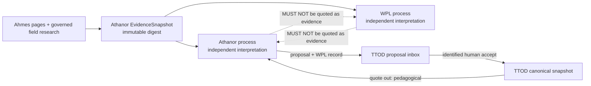
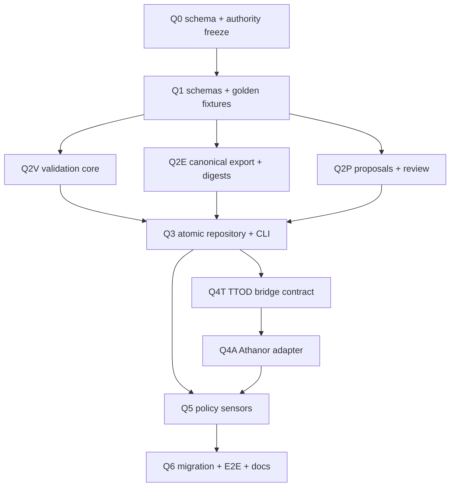

<!--
TTOD Phase Q — contract repair and Athanor-mediated quotation bridge.
Planning baseline: 2026-08-14. No live implementation performed by this document.
-->

# Phase Q — TTOD contract repair and two-way Athanor bridge

**Status:** READY at Q0 schema/authority freeze

**Owner:** TTOD product owner; Athanor owns mediation; WPL owns portable provenance semantics

**Calendar proposal:** 2026-08-17 → 2026-08-28; gates decide movement, dates do not

**Estimate:** 8–11 engineering days plus 2–3 focused human review days; 2 calendar weeks with
isolated parallel lanes, or 3–4 weeks sequentially

**Baseline:** [`PHASE-Q0-READINESS-REPORT.md`](PHASE-Q0-READINESS-REPORT.md)

## 1. Outcome and non-negotiable boundaries

Phase Q turns TTOD into a mechanically governed, deterministic, bidirectional studio component:

- **Quote out:** Athanor serves a content-addressed TTOD snapshot and selected quote by immutable
  TTOD ID, preserving origin, license, validation, relations, deprecation, and ancestry.
- **Proposal in:** Athanor can return a generated quote proposal with its WPL generation record and
  shared evidence snapshot. The proposal has a proposal ID, never a canonical TTOD ID.
- **Human promotion:** only an explicit human review command may allocate a canonical ID and
  atomically modify `ttod.yml`.
- **Shared grounding:** Athanor and WPL independently consume the same immutable evidence snapshot,
  including ingested knowledge and governed field research. They do not quote or cite each other's
  draft prose.
- **Pedagogy is not corroboration:** a TTOD quote is served with `usage_role=pedagogical`. It cannot
  satisfy a WPL/Athanor evidence requirement unless the original upstream source is independently
  resolved and cited as the evidence.
- **No silent provenance promotion:** absent legacy origin is `legacy-unknown`, not `human`;
  absent item-level rights are unresolved, not inherited by guess.

The canonical authority order for this programme is:

1. applicable law, rights-holder restrictions, consent, and institutional decisions;
2. the frozen portable WPL contract and Athanor Provenance Law;
3. the TTOD v3 schema and human review record;
4. the Athanor adapter and CLI implementation;
5. generated proposals, exports, plans, and model statements.

An implementation may be stricter than WPL Core. It may not weaken portable meaning. A conflict
blocks promotion and becomes a versioned decision record; neither Athanor nor WPL silently quotes
the other into authority.

## 2. Target data contract

### 2.1 Canonical quote record

Schema v3 retains all current content fields and defines these machine-checked axes separately:

| Axis | Required v3 shape | Rule |
| --- | --- | --- |
| Identity | `id`, `schema_version`, `content_digest` | canonical ID is immutable; digest uses TTOD-C14N-v1 |
| Content | `text`, `section`, `subsection`, `level`, `tags`, `teaches`, optional display fields | text and tags are Unicode strings normalized to NFC; tags are controlled |
| Authorship | `origin`, `authorship_assertion` | `human`, `studio`, `blackbox`, `mixed`, or `legacy-unknown`; no default-to-human |
| Review | `validation.status`, `method`, `reviewer_id`, `activity_id`, `reviewed_at`, `record_digest` | blackbox/mixed content cannot become active without an identified human acceptance activity |
| Source | `source_refs[]` with `source_id`, `locator`, `content_digest`, `role`, `derivation_method` | preserve native identifiers; no invented source metadata |
| Evidence | `evidence_snapshot_digest`, optional `wpl_record_id` and `wpl_record_digest` | generation provenance is not evidence truth; shared snapshot is the common input |
| Rights | `rights.license`, `holder`, `permission_basis`, `access`, `restrictions`, `decision_ref` | item-level terms travel with the quote; unresolved blocks public export |
| Relations | `related[]` plus typed `relation_edges[]` where added under v3 | preserve order and targets; never fabricate reverse links |
| Lifecycle | `status=active|deprecated|erased`, `deprecated_by`, `superseded_by`, `reason`, `effective_at` | ordinary removal is deprecation; erasure is a protected exception |
| Ancestry | `immediate_parent_refs[]`, `root_source_refs[]`, `proposal_id` | retain the full derivation path without using ancestors as corroboration |

Compatibility decisions to freeze in Q0:

- `schema/quote.schema.json` validates a quote; `schema/ttod.schema.json` validates the root and
  references it; `schema/proposal.schema.json` validates pre-canonical proposals.
- Existing values remain byte-preserved in the migration input. Missing provenance becomes an
  explicit unresolved/legacy state; migration must not manufacture reviewer, author, source, or
  license facts.
- Keep legacy `source` and `validated_by` only as read-compatible mirrors during one declared
  transition. Structured fields are authoritative. Removal requires a later major version.
- YAML date-like values are normalized to ISO-8601 strings at the domain boundary. Numeric tag
  scalars such as `404` must be rejected or migrated explicitly to the string `"404"`.
- `related` remains directed. Bidirectionality may be proposed and reviewed, never inferred during
  migration.

### 2.2 Proposal record

A proposal carries:

```text
proposal_id (UUID/URN allocated before review)
status = proposed | needs_revision | accepted | rejected | withdrawn
candidate content without canonical id
proposer kind/id and observed-or-declared generation method
WPL generation record id + digest
shared Athanor evidence snapshot id + digest
source refs, origin, rights, relations, and ancestry exactly as received
human review activities[]
accepted_quote_id only after an atomic acceptance transaction
```

No proposal reserves a section-number ID. Acceptance takes the repository lock, re-reads the live
snapshot, allocates the next unused section ID, validates every root invariant, writes atomically,
and only then records `accepted_quote_id`.

### 2.3 Deterministic identity

Define `TTOD-C14N-v1` in docs and code:

1. recursively normalize every string to Unicode NFC;
2. reject non-string identifiers/tags and non-finite numbers;
3. emit UTF-8 JSON with lexicographically sorted object keys, preserved array order, fixed compact
   separators, and one terminal newline;
4. compute SHA-256 over the canonical quote projection for `content_digest`;
5. compute the snapshot digest over quotes sorted by canonical ID plus schema/taxonomy/collection
   policy versions; and
6. record algorithm, projection version, source-file digest, record count, export options, and
   included/excluded lifecycle states in a signed-or-hashed snapshot manifest.

Two exports from the same canonical state and options must be byte-identical. JSON and graph
exports must write to a sibling temporary file, flush/fsync, validate, and atomically replace the
target. They must never create `exports/` before validation succeeds.

## 3. Independence and shared-grounding protocol



`EvidenceSnapshot` is the only shared grounding interchange. Each source unit includes native
document/node identity, source/content digest, page/spatial locator when available, extraction or
field-research method, asserted/inferred state, citation-resolution/evaluator-safe result,
permission/access status, and snapshot/harness versions. Restricted field research stays
protected; “shared” means identical governed identity, not public disclosure.

The processes may compare conclusions only after each output is frozen. The reconciliation record
may link both outputs, but it cannot convert either output into the other's source. The policy
sensor rejects these edges:

- `AthanorDraft -> supports -> WPLClaim`;
- `WPLDraft -> supports -> AthanorDecision`;
- `TTODQuote(source=AthanorPlan) -> supports -> AthanorDecision`; and
- any `quotation` whose evidence pointer resolves only to a sibling output or a TTOD copy.

`arch-052` is the permanent adversarial fixture for the third rule. Its current ancestry points to
an Athanor Phase 2 plan. It may round-trip as a pedagogical quote, but it must surface
`evidence_admissible=false` and `independence_reason=SELF_DERIVED_NOT_EVIDENCE` when the consuming
claim belongs to Athanor or WPL architecture.

If wording is intended as a scholarly quotation, Athanor must resolve it to the original source
edition/page and human validation status. TTOD is never a shortcut around that boundary.

## 4A. Shared bridge bindings and graph roadmap (non-blocking)

The reusable studio contract is
[`deviac/docs/DEV_PLAN/TTOD-BRIDGE-INTEROPERABILITY-CONTRACT.md`](../../../deviac/docs/DEV_PLAN/TTOD-BRIDGE-INTEROPERABILITY-CONTRACT.md).
Q phases implement its bindings; they do not create a TTOD-specific protocol fork. REST resources,
offline bundles, and JSON-LD/RDF graph projections carry the same transfer IDs, snapshot/content
digests, lineage, rights, review state, and idempotency semantics. REST is an operational adapter;
the graph projection is the lossless semantic interchange.

Keep `ttod.yml` canonical during Q. First emit and validate a deterministic read-only graph
projection, compare identity/order/taxonomy/collection/rights/lifecycle round trips, and benchmark
graph queries against the relational path. A writable graph backend is a later, non-blocking RFC;
it cannot change human promotion or quote authority.

All counts and coverage are dynamic projections. No implementation or documentation may hardcode a
current quote count. `meta.total_quotes`, section/level statistics, collections, and dashboards
are recomputed from the canonical snapshot; `stats --check` reports drift with snapshot digest and
generation time, and only a human-approved atomic transaction repairs it.

## 4. Dependency DAG and orchestration



Parallelism is allowed only across isolated worktrees with disjoint touched paths and frozen
interfaces. Shared `cli.py`, `ttod.yml`, schemas, lockfiles, and generated snapshots merge
sequentially. Only one lane may run a live Athanor/Postgres/Ollama integration at a time.

| Phase | Estimate | Mode | Entry | Exit |
| --- | ---: | --- | --- | --- |
| Q0 | 0.5–1 d | sequential blocker | this plan + readiness audit | signed decisions/baseline; recoverable boundary |
| Q1 | 1–1.5 d | sequential | Q0 green | schemas and golden fixtures validate/fail as intended |
| Q2V | 1–1.5 d | parallel | Q1 | strict root/record/reference/derived-state gates |
| Q2E | 1 d | parallel | Q1 | byte-stable exports and manifests |
| Q2P | 1–1.5 d | parallel | Q1 | proposal lifecycle and human-review gates |
| Q3 | 1–2 d | sequential | Q2 lanes green | atomic CLI transactions and failure rollback |
| Q4 | 1.5–2.5 d | TTOD then Athanor | Q3 + Athanor S0-WPL freeze | two-way round-trip, no canonical auto-write |
| Q5 | 1–1.5 d | parallel by sensor | Q3/Q4 contract | independence, rights, lifecycle, provenance sensors green |
| Q6 | 1–1.5 d | sequential | Q4/Q5 green | migration, E2E, docs/comments, rollback proof, report |

## 5. Phase prompts and touched-path budgets

### Q0 — schema and authority freeze

```text
Act as TTOD contract steward. Read CLAUDE.md, .cursor/rules/ttod-editing.mdc, this cascade,
PHASE-Q0-READINESS-REPORT.md, cli.py, the ttod.yml header and complete root schema, the source
README, the DevIAC knowledge flywheel, Athanor Provenance Law/Phase S, and the frozen WPL contract.
Record hashes and repository status. Do not edit canonical data.

Freeze: v3 field names/enums; compatibility period; TTOD-C14N-v1 projection; proposal lifecycle;
human reviewer identity shape; rights/unresolved policy; higher-law erasure authority; shared
EvidenceSnapshot fields; sibling-output prohibition; arch-052 expected verdict; Athanor/WPL
version pins. Establish a recoverable TTOD baseline before mutation. File Q0 report and decision
record. No unresolved semantic decision may leak into Q1.
```

Touched-path budget: `docs/DEV_PLAN/`, decision artifacts, and a read-only baseline artifact only.
No `ttod.yml`, dependency, export, source chapter, corpus, or external database write.

### Q1 — schemas and contract fixtures

```text
Implement Draft 2020-12 quote, root, and proposal JSON Schemas from the frozen decision record.
Create positive fixtures for legacy-read, v3 human, reviewed-blackbox, deprecated, and protected
erasure-tombstone records. Create one focused negative fixture per invariant: missing review,
unknown/non-string tag, missing rights decision on public export, dangling relation, canonical ID
inside a proposal, broken ancestry, digest mismatch, sibling-output evidence, and arch-052
self-corroboration. Make failures assert exact codes, not prose substrings.
```

Touched-path budget: `schema/*.json`, `tests/fixtures/q1_*`, `tests/test_schema_contract.py`, and
contract docs. Do not edit `cli.py` or `ttod.yml`.

### Q2V / Q2E / Q2P — parallel core lanes

```text
Q2V owns ttod_core/validation.py and tests/test_validation.py. Enforce JSON Schema plus global
identity, prefix/section, root count/max-ID, taxonomy, collections, lessons, relation, lifecycle,
rights, review, and ancestry invariants. Never count missing origin as human. Emit stable codes and
JSON diagnostics. --strict must fail all drift; compatibility warnings remain nonzero in report.

Q2E owns ttod_core/canonical.py, ttod_core/exporter.py, and their tests. Implement
TTOD-C14N-v1, content/snapshot/manifest digests, deterministic JSON/graph output, atomic export,
and export policy for deprecated/erased/restricted records. Preserve fields and array order.

Q2P owns ttod_core/proposals.py and tests/test_proposals.py. Implement proposal IDs before
canonical IDs, append-only review activities, identified-human acceptance, rejection/withdrawal,
rights and provenance carry-through, and no write to ttod.yml. A machine may propose but may not
accept. Preserve proposal ancestry and the WPL/evidence digests exactly.
```

The lanes must not edit the same file. Shared interfaces are frozen in Q1. If an interface is
wrong, stop and amend Q1 sequentially; do not fork incompatible local interpretations.

### Q3 — atomic repository and CLI

```text
Integrate the Q2 cores behind cli.py. Replace text append with parse -> construct candidate ->
validate complete candidate -> acquire exclusive lock -> re-read/rebase -> allocate ID -> write
same-directory temp -> flush/fsync -> atomic rename -> validate persisted bytes. On every failure,
ttod.yml remains byte-identical and the proposal remains resumable.

Add validate --strict/--json, stats --check, snapshot, export, proposal create/import/review/accept,
deprecate, and guarded erase commands. `add` becomes a human-authored proposal+accept convenience
path or is deprecated; it never bypasses review/transaction rules. Recompute totals, last IDs,
taxonomy decisions, collection counts, statistics, and coverage in the same candidate snapshot.
Never copy a literal count from documentation; expose the generated snapshot digest and counts
through CLI/API responses.
Reject unknown tags by default; taxonomy extension is an explicit reviewed operation.
```

Touched-path budget: `cli.py`, `ttod_core/repository.py`, `pyproject.toml`, CLI integration tests,
and migration script. Do not migrate live `ttod.yml` yet.

### Q4 — Athanor-mediated two-way bridge

```text
First freeze and test a TTOD transport schema. Quote-out returns canonical quote ID/text/content
digest, snapshot digest, origin, item rights, review status, relations, lifecycle, ancestry, and
usage_role=pedagogical. Proposal-in accepts a proposal without canonical ID and preserves the WPL
record and EvidenceSnapshot identifiers/digests. No transport field may be silently dropped.

Then implement the Athanor adapter through its hexagonal ports. Athanor reads only a versioned
TTOD export/snapshot, never ttod.yml. Athanor stores generated proposal/provenance in its own
outbox and returns a portable proposal artifact; it has no filesystem/database credential that can
mutate canonical TTOD. A human explicitly imports and accepts through TTOD CLI after reading
.cursor/rules/ttod-editing.mdc. Run the round trip in both directions and compare every protected
field and digest.
```

TTOD touched-path budget: bridge schema/core/tests and CLI transport wiring. Athanor work uses a
separate Athanor phase/worktree and its declared domain/application/adapter/tests budget. If those
paths overlap active Phase S work, queue integration rather than overwrite it.

### Q5 — policy and provenance sensors

```text
Build deterministic sensors for sibling-process quotation, evidence admissibility, rights/public
export, observed-vs-declared generation, human acceptance, immutable ID/deprecation, higher-law
erasure, digest transfer, and shared-snapshot equality. Every sensor has positive and negative
fixtures. Use arch-052 as the self-corroboration adversary.

Ordinary deletion fails. A higher-law erasure requires an identified human authority, decision
reference, exact scope, and protected audit record; it replaces public content with a tombstone and
must not retain the erased personal content merely to satisfy provenance. The system records the
decision and authority—it does not adjudicate law. Public export excludes or redacts protected
records according to the recorded decision.
```

Touched-path budget: policy module, sensor scripts, focused fixtures/tests. No live canonical or
corpus mutation.

### Q6 — migration, E2E, and same-patch documentation

```text
Re-hash the Q0 inputs and reconcile any drift. Generate a v3 candidate in a temporary path. Do not
invent missing authorship, validation, sources, or licenses. Convert numeric 404 tags only through
an explicit migration decision. Recompute all derived metadata mechanically. Show a semantic diff
and obtain human approval before replacing ttod.yml atomically.

Run the full gate matrix and a real TTOD -> Athanor -> proposal -> TTOD review/accept round trip on
fixtures. Run failure injection after lock, after temp write, and before rename; prove source bytes
survive. Verify arch-052 is displayable but evidence-inadmissible for Athanor/WPL architecture.

In the same implementation patch update CLAUDE.md, .cursor/rules/ttod-editing.mdc, the source
README, user CLI docs, DEV_PLAN status/report, schema examples, and every pertinent public
docstring/invariant comment. Comments explain the boundary (atomicity, human promotion,
self-corroboration, rights/erasure), not line-by-line mechanics. A schema or behavior change with
stale docs/comments fails the docs-contract gate.
```

Touched-path budget: approved candidate `ttod.yml`, documentation/rules, pertinent docstrings,
release report, and generated baseline manifest. No source-chapter rewrite, corpus injection,
deployment, commit, or push unless separately authorized.

## 6. Mechanical gate matrix

| Gate | Required proof |
| --- | --- |
| Baseline | input hashes/status; no secrets; recoverable pre-migration copy/snapshot |
| Schema | quote/root/proposal positive fixtures pass; each negative fails with expected code |
| Current-data strictness | baseline inconsistencies are reported; post-migration `validate --strict` is green |
| Transaction | successful add/accept updates quote, totals, max ID, taxonomy decision, collections, statistics together |
| Rollback | induced failures leave `ttod.yml` byte-identical and no orphan canonical ID |
| Concurrency | two acceptors serialize and receive distinct IDs or one clean retry; never duplicate |
| Review | blackbox/mixed proposal without identified human acceptance cannot become active |
| Determinism | two clean exports/snapshots are byte-identical and share digests |
| Integrity | content/snapshot/WPL/evidence digest tampering fails |
| Reference | related, collection, lesson, ancestry, deprecation/supersession targets resolve |
| Rights | item terms survive round trip; unresolved/restricted content cannot enter public export |
| Erasure | normal delete fails; authorized tombstone path removes protected content and keeps minimal lawful audit |
| Independence | sibling prose and `arch-052` cannot satisfy `supports_claim`; common snapshot remains usable by both processes |
| Round trip | TTOD-out and proposal-in preserve origin/license/validation/related/deprecation/ancestry and all digests |
| Capability | Athanor credentials cannot write canonical TTOD; model can propose but cannot accept |
| Documentation | changed contract appears in schemas, CLI help, CLAUDE, Cursor rule, source README, plan/report, and pertinent code comments/docstrings |
| No mutation | no corpus injection, shared DB migration, deployment, commit, push, or source-chapter rewrite without separate authority |

Recommended commands after implementation (names are acceptance targets, not claims that they
exist today):

```bash
. .venv/bin/activate
python cli.py validate --strict --json
python cli.py stats --check
python -m unittest discover -s tests -p 'test_*.py'
python cli.py snapshot --output /private/tmp/ttod-snapshot-a.json
python cli.py snapshot --output /private/tmp/ttod-snapshot-b.json
cmp /private/tmp/ttod-snapshot-a.json /private/tmp/ttod-snapshot-b.json
python cli.py bridge-self-test --fixture tests/fixtures/q4_roundtrip.json
```

## 7. Rollback and mutation law

- Before the first canonical write, record the original byte digest and make a recoverable,
  permission-preserving backup outside the target filename.
- Never rewrite the source chapters during quote extraction; they remain immutable source inputs.
- Never assign canonical IDs during generation or proposal import.
- Never write a partially validated root, export, proposal acceptance, or lifecycle transition.
- No model tool has an `accept`, `deprecate`, or `erase` capability.
- Deprecation is default retirement. Erasure is exceptional, human-authorized, scoped, and
  tombstoned without retaining prohibited content.
- If an E2E gate fails, restore the exact pre-migration bytes, retain failure artifacts, mark the
  phase `BLOCKED` or `PARTIAL`, and publish the safe resume point. Do not weaken the gate.

## 8. Documentation and code-comment propagation contract

Every implementation phase carries a documentation delta in its touched-path budget. The release
reviewer checks this mapping:

| Invariant changed | Must update in the same patch |
| --- | --- |
| Record/proposal field | JSON Schema, contract doc, fixture, CLI JSON/help, relevant model docstring |
| Editing/promotion rule | `.cursor/rules/ttod-editing.mdc`, `CLAUDE.md`, CLI command help, review tests |
| Count/statistics behavior | `CLAUDE.md`, CLI stats docs, consistency tests; avoid unstamped hard-coded totals |
| Athanor bridge | transport schema, Athanor port/adapter docstrings, TTOD bridge docs, round-trip fixture |
| WPL/evidence transfer | provenance mapping, EvidenceSnapshot fixture, sensor messages, phase reports |
| Rights/lifecycle/erasure | source README, public-export docs, invariant comments at destructive boundary, negative tests |
| Self-corroboration | architecture docs, policy sensor, `arch-052` adversarial fixture, consumer-facing explanation |

Generated code comments are not provenance records. Comments should state durable reasons and
invariants; hashes, commands, reviewer decisions, and evidence remain in reports/manifests.

## 9. Calendar momentum

| Date | Work | Product-owner checkpoint |
| --- | --- | --- |
| Mon 17 Aug | Q0 freeze | approve compatibility, rights, erasure, and evidence-independence decisions |
| Tue 18–Wed 19 Aug | Q1 | schemas and adversarial fixtures frozen |
| Thu 20–Fri 21 Aug | Q2V/Q2E/Q2P parallel | all core lanes green; no shared-file collision |
| Mon 24 Aug | Q3 | atomic CLI and rollback proof |
| Tue 25–Wed 26 Aug | Q4 TTOD then Athanor | two-way field-preserving bridge; no canonical write credential |
| Thu 27 Aug | Q5 | independence/rights/lifecycle sensors green |
| Fri 28 Aug | Q6 | approved migration, E2E, docs/comments, release/no-release decision |

Calendar slip is acceptable. A failed gate never becomes schedule permission.

## 10. Master orchestrator prompt

```text
You are the TTOD Phase Q programme engineer. Execute only the next READY node in
docs/DEV_PLAN/PHASE-Q-TTOD-CONTRACT-REPAIR-CASCADE.md.

Before editing, read TTOD CLAUDE.md and .cursor/rules/ttod-editing.mdc completely, the active phase
prompt, the latest prior report, and the applicable Athanor/WPL contract versions. Inspect current
hashes and repository state. Treat older counts and prose as claims to verify.

Use an isolated worktree/branch per parallel lane. Enforce touched-path budgets. Run computation
before model review. Never let an agent/model allocate a canonical quote ID, accept a proposal,
write ttod.yml directly, infer missing human authorship, silently relicense material, use sibling
process prose as evidence, or use a TTOD quote as corroboration of its own ancestor.

Athanor and WPL may use the same immutable EvidenceSnapshot digest. They produce independent
outputs and cannot quote each other. TTOD quote-out is pedagogical. Proposal-in remains
non-canonical until identified human acceptance under TTOD rules.

For each phase, file a report containing state, input hashes, exact commands/exits, artifacts,
negative and failure-injection results, files/external state touched, decisions, provenance transfer
matrix, and exact resume point. Update plan status only after gates and report are green. Ensure
schema changes propagate to docs and pertinent code comments/docstrings in the same patch.

Run Q0 first. Never claim Phase Q complete from planning-document checks alone.
```
