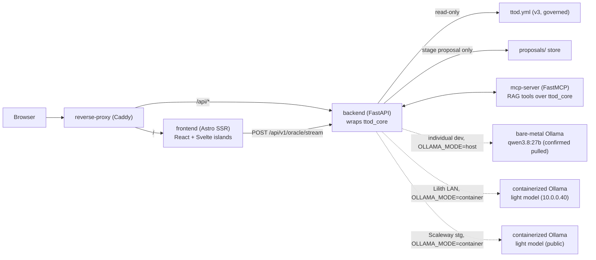
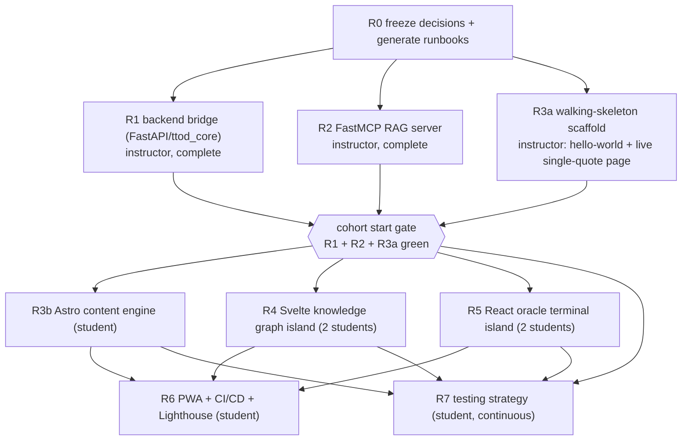

<!--
TTOD Phase R — Oracle Platform cascade-generator prompt (the mold, not the forge).

Merges three source drafts pasted 2026-09-04: (1) a master infrastructure/architecture
scaffolder directive, (2) an Astro Content-Collections + hybrid-UX clarification, (3) a
multi-phase "Astro Islands" strategy with a 10-student task plan. All three used a generic
"TDOD" placeholder and an invented "TDOD Pluggable System Architecture"; this file replaces
that placeholder with the real TTOD v3 contract (Phase Q, DONE 2026-08-18) and its actual code
surface (`ttod_core/`, `cli.py`, `schema/`), and reconciles the stack against real studio
infra rules in /Users/ruvebal/src/CLAUDE.md (Ollama is native on Tanit, not containerized there;
deploy target is normally Lilith, not a public droplet).

Author: ruvebal@crea-comm.net · Planning baseline: 2026-09-04.
No live implementation performed by this document.
-->

# Phase R — TTOD Oracle Platform (cascade-generator prompt)

**Status (updated 2026-09-05, closure audit):** R0–R5 DONE, R7 PARTIAL, **R6 deliberately deferred
and reserved for student ownership — not implemented, not authorized by any of this momentum** (see
[`DECISIONS/R6-DEFERRED-STUDENT-OWNED.md`](DECISIONS/R6-DEFERRED-STUDENT-OWNED.md)). R3b/R4/R5 exist
as a reference/architectural-validation build on `main`, not the cohort's own starter — see
[`PHASE-R-CLOSURE-AND-COHORT-HANDOFF-REPORT.md`](PHASE-R-CLOSURE-AND-COHORT-HANDOFF-REPORT.md) and
the generated `cohort-starter` branch (`scripts/generate-cohort-starter.sh`) for the R1/R2/R3a-only
tree students actually receive. Depends on Phase Q, which is DONE
(2026-08-18): see [`PHASE-Q-TTOD-CONTRACT-REPAIR-CASCADE.md`](PHASE-Q-TTOD-CONTRACT-REPAIR-CASCADE.md).

**Owner:** TTOD product owner (Rubén Vega Balbás PhD)

**Calendar proposal:** cohort delivery target mid-October 2026; gates decide movement, dates do
not.

**One-line scope:** wrap the existing, already-governed TTOD wisdom database (`ttod.yml` v3.0.0

- `ttod_core/` + `cli.py`) in a four-service host-mode / five-container integration platform — Astro control plane with a Svelte
  knowledge-graph island and a React oracle-chat island, a thin FastAPI bridge, a FastMCP RAG
  server, and Ollama — without ever giving the web layer a second, uncontrolled way to write
  `ttod.yml`.

---

## 0. How to use this document (read first — mold vs. forge)

**This file is a mold. It is not the forge.** Its job is to _generate_ the actual, executable
cascade plan — a set of self-contained phase runbooks — not to be handed to an agent as the
entire task in one shot.

This split is not a new idea invented for this milestone; it is how TTOD already runs Phase Q
and how DevIAC runs its own cascades:

- [`PHASE-Q-TTOD-CONTRACT-REPAIR-CASCADE.md`](PHASE-Q-TTOD-CONTRACT-REPAIR-CASCADE.md) §5: _"Do
  not hand an agent this master document alone and ask it to 'do Q3' — hand it the Q3 runbook."_
  Nine runbooks live under [`PHASES/`](PHASES/), one per phase, each self-contained.
- `deviac/docs/DEV_PLAN/PHASE-T-CASCADE-PROMPT.md`: a single orchestrator-prompt file that
  points at per-phase files (`PHASE-T4.md` … `PHASE-T8.md`) rather than embedding every phase's
  full detail inline.

Phase R follows the same discipline, in two stages:

**Stage 1 — generate (this is what R0 does).** Hand this document to an agent session with
instruction to produce, under `docs/DEV_PLAN/PHASES/`, one runbook per row of the table in §6
(`R1-backend-bridge.md` … `R7-testing-strategy.md`), each restating — not cross-referencing — the
relevant slice of §§1–5, 7–9 inline, so a fresh agent session with _no other file open_ can
execute it. R0 itself has no separate runbook file; it is this document's own first act, and its
report is `PHASE-R0-REPORT.md`. Do not scaffold any container, dependency, or line of app code
during R0. R0's only deliverables are: frozen decisions (§0.1), the generated runbook files, and
an updated [`INDEX.md`](INDEX.md) row.

**Stage 2 — forge.** One runbook, one agent session, one phase at a time, in dependency order
(§6). A runbook is derived from this document; if this document changes, regenerate the runbook,
never hand-edit it to diverge.

### 0.1 Decisions frozen 2026-09-04

1. **Audience and scale — RESOLVED, with an instructor-first gate.** Rubén personally owns and
   completes R1 (FastAPI backend), R2 (FastMCP server), and the new **R3a walking-skeleton
   scaffold** — a minimal Astro project (hello-world welcome page plus one live page that fetches
   and renders a single real quote through the full pipeline: Astro → `backend` → `ttod_core` →
   `ttod.yml` → back to the browser) with `docker-compose`/Caddy wiring for four services in host
   mode and all five in the explicit container profile. This
   is the literal Alistair Cockburn "walking skeleton": the thinnest possible slice, working
   end-to-end, before anyone builds a feature on top of it. **7 students start only once R1, R2,
   and R3a are all green** — they inherit a verified, running stack instead of debugging container
   networking on day one. From there: R3b (Astro content engine, continues from R3a) — 1 student;
   R4 (Svelte graph island) — 2 students; R5 (React oracle island) — 2 students; R6 (PWA + CI/CD)
   — 1 student; R7 (continuous testing, §6) — 1 student. Total 7, no pairing beyond R4/R5's
   natural two-role split (data/canvas vs. animation; streaming-state vs. motion/hotkeys),
   inherited from the original task-package breakdown. §6 has the full table and dependency graph.
2. **Ollama placement — RESOLVED, three tiers, not one switch.** Per
   [`/Users/ruvebal/src/CLAUDE.md`](/Users/ruvebal/src/CLAUDE.md) Hard Rule 2 (Ollama is native on
   Tanit; containerized Ollama is Lilith-only), Phase R uses three distinct Ollama placements
   rather than a single container/host toggle:
   - **Individual dev (any laptop, Tanit included):** `OLLAMA_MODE=host`, bare-metal Ollama,
     model `qwen3.8:27b` — used for hard dev-sprint iteration on oracle/RAG quality with a
     stronger model. **Confirmed real and already pulled** (`ollama list`, 2026-09-06: 27.3B
     params, family `qwen35`, `Q4_K_M` quant, 262144 context, `completion`/`tools`/`thinking`/
     `vision` capabilities) — the earlier doubt about this tag not matching standard Ollama
     `family:size` naming is resolved; no substitution needed. Also locally available on the same
     host: `qwen2.5:32b-instruct`, `qwen2.5:72b-instruct-q4_K_M`, `qwen2.5:7b`, `qwen2.5:3b`, and
     the studio's own `thessia-scholar-v3`/`thessia-coder-v3`/`thessia-sentinel-v3` fine-tunes (the
     last is reserved — see `PHASE-S-TTOD-BILINGUAL-CONTENT-MODEL.md` §S4, do not repurpose it).
   - **Lilith — corrected 2026-09-06: instructor-only, not a cohort resource.** Earlier drafts of
     this document called Lilith "shared cohort dev/integration" — **that was wrong and is
     retracted.** Lilith and Tanit are both Rubén's own private studio machines; **neither the 7
     students nor anyone outside the studio can reach either one.** Lilith's real role is narrower
     and purely instructor-facing: a second environment, parallel to Tanit, running the same
     containerized stack (full profile, including containerized Ollama — matches Hard Rule 2's
     "Docker Ollama = Lilith only") so Rubén can validate the reference build on Linux and prove
     the architecture is host-portable before ever telling students it works cross-platform. Light
     model tags there: same as the container profile generally (`llama3.2:1b`/`qwen2.5:1.5b`) —
     **confirm pulled before relying on this**, do not assume from this document alone.
     **What students actually get instead:** every student runs the stack on their own machine —
     personal laptop or a university lab computer (§2.4) — using the individual-dev tier above
     (host-mode Ollama if they have one, or `--profile container` with an explicit local
     `ollama pull` if they don't). There is no shared LAN environment in the cohort's own path at
     all; the only tier anyone outside the studio can ever reach is Scaleway, below, and only once
     that deployment decision is signed.
   - **Scaleway (cloud, public):** containerized, light model only (same tag as the container
     profile generally, same pull-step caveat above) — see decision 3. This is the *only* tier
     reachable by anyone other than Rubén himself.
     `.env` gains `OLLAMA_MODE=host|container` per the placement above, plus `OLLAMA_MODEL` so the
     pulled tag is never hardcoded in application code.
3. **Public deployment target — RESOLVED.** Cloud provider is **Scaleway**, not DigitalOcean —
   EU-hosted, which sits better with CC BY-NC-SA 4.0 content and an EU cohort than the source
   draft's US droplet. Topology: **single staging environment only** (`stg.` subdomain), sized at
   roughly a 3–4 vCPU / 4–8 GB instance (~€15–20/mo — verify against Scaleway's current price list
   before committing budget; this document does not treat that figure as final). No separate
   production instance and no blue/green swap: for a 7-student course project the CI budget is
   better spent on the test suite (R7) than on deploy orchestration. If the platform is kept
   running after grading, promoting `stg` to a real `prod` is a separate, later decision — record
   it the same way as [`DECISIONS/Q0-2026-08-18-RIGHTS-LICENSE-NC.md`](DECISIONS/Q0-2026-08-18-RIGHTS-LICENSE-NC.md)
   before it happens. Until this decision, R6 only builds/tests in CI against Scaleway; the deploy
   step targets the single `stg` host.
4. **Testing strategy — RESOLVED.** New cross-cutting lane R7, aligned to the cohort's own
   syllabus at
   `web-atelier-udit/web-foundations/docs/lessons/en/react/react-testing/` (Testing Trophy, Vitest,
   RTL, MSW, first CI workflow) and
   `.../en/feii/unit-5-testing-strategy/` (flakiness, Cypress→Playwright migration, CI wall-clock
   budget, contract testing, accessibility-in-suite). Phase R **reuses that syllabus's stack
   as-is**: Vitest + React Testing Library + MSW for unit/component tests, **Playwright with the
   `chromium` project only** for E2E (matches `npx playwright install --with-deps chromium` —
   Firefox/WebKit projects are not required unless a cross-browser bug surfaces), `@axe-core/
playwright` assertions folded into the suite rather than a separate audit, and a contract-test
   suite that hits R1's real `/api/v1/*` endpoints and asserts shape (against `schema/*.json` /
   `domain.ts`), never values — precisely the pattern unit 5 §6 teaches, now applied to a backend
   this cohort itself built. §4.1, §6, §7, and §9 fix the details.
5. **FE II Deliverable 1 alignment — RESOLVED.** Confirmed against the live course track
   (`web-atelier-udit/.../2627-feii/how-to-pass-this-track/data/content.json`): R3a–R7 collectively
   **are** Entrega 1 — "Astro Architectural Project" (Units 2-6), **25% of the FE II grade, due
   Week 7 (October 2026)**. Its stated requirements cross-walk onto Phase R almost feature-for-
   feature — content collections (R3b), islands architecture + multi-framework integration (R4,
   R5), testing suite Vitest+RTL+Playwright (R7), CI/CD (R6) — **except one gap**: Deliverable 1
   requires **mandatory Astro i18n routing (es + en locales)**, which was not previously in Phase
   R's scope. Added to R3a (scaffold the `astro.config.mjs` i18n config and locale routing from
   the start — retrofitting i18n later is expensive) and R3b (translated content); see §3, §5, §7.
   Deliverable 1 also requires an **"AI-assisted code review workflow"** — this is not a new,
   separate requirement to invent; it **is** the cold-review protocol in §6.1, which already
   mirrors FE II Unit 6 ("AI-Assisted Code Review," where "the suite you build [in Unit 5] becomes
   something an AI reviews with you"). The dev process this document prescribes and the graded
   deliverable are the same artifact, not two parallel obligations. **Calendar consequence:** R1,
   R2, and R3a (the instructor-owned walking skeleton) must be green early enough — target early-
   to-mid September — to leave R3b through R7 roughly four to five weeks before the Week 7/October
   deadline.

   **Phase R is a superset of Deliverable 1, not a 1:1 match — say so explicitly so the calendar
   math stays honest.** Deliverable 1's own text names Astro, content collections, i18n, islands,
   multi-framework integration, a Vitest+RTL+Playwright suite, and CI/CD. It does not name FastAPI,
   FastMCP, Ollama, a knowledge graph, PWA offline support, or a Scaleway deployment — those are
   this document's own architecture, not the grading rubric's. This is not a contradiction: R1
   (FastAPI), R2 (FastMCP), and R3a's backend-facing plumbing are **instructor-owned infrastructure**
   (§0.1.1), built and green _before_ the cohort start gate opens, and therefore never counted
   against the students' four-to-five-week Week-7 calendar in the first place. The calendar risk
   this decision must actually be checked against is narrower and more honest than "can the cohort
   build the whole Oracle Platform by Week 7" — it is "can R3b–R7 (the student-owned subset, which
   _is_ essentially Deliverable 1) land in four to five weeks against an already-working backend."
   R6's PWA/CI/Scaleway work is real scope beyond Deliverable 1's literal text, but it is Deliverable
   1's own named "CI/CD" requirement extended, not an unrelated addition — still worth flagging
   explicitly in R0's report as scope beyond the graded minimum, not silently absorbed into "R6 is
   just CI/CD."

6. **Bilingual content model — RESOLVED, but implementation is a hard prerequisite for R1.**
   `docs/DEV_PLAN/PHASE-S-TTOD-BILINGUAL-CONTENT-MODEL.md` (decision frozen in
   [`DECISIONS/S0-2026-09-04-BILINGUAL-CONTENT-MODEL.md`](DECISIONS/S0-2026-09-04-BILINGUAL-CONTENT-MODEL.md))
   adds a per-quote `lang` field and a `translation_of` relation so a Spanish quote is a separate,
   independently-governed record linked to its English original — not a locale-keyed field on the
   same record. `domain.ts`'s `WisdomEntry.lang` and `GraphLink['rel']`'s `'translation_of'`
   member (§4, §4.1) are already patched to match. **R0 must not generate R1's runbook, and R1
   must not treat its `/api/v1/*` contract as frozen, until Phase S's S1′ (schema) is at least
   green** — otherwise R1 ships a contract Phase S then breaks. R1 does not need to wait for
   Phase S's S2′ migration or S3′ doc propagation to _start writing code_, only for S1′'s schema
   shape to be settled. **But S1′ alone is not enough to run R1 against real data.** S1′ makes
   `lang` a required field in the schema; it does not touch the live `ttod.yml` file. Between S1′
   landing and S2′ completing, the live file is schema-invalid (`validate --strict` fails, every
   quote is missing `lang`) and every `GraphNode`/`WisdomEntry` read from it will carry
   `lang: null` — not a safe default, an absent value. **R1 must not be run, tested, or deployed
   against the live file until Phase S's S2′ is also green** (`validate --strict` exits 0). R0's
   generated R1 runbook must state this as an explicit precondition check (e.g. `cli.py validate
--strict` exits 0 before `podman-compose up` is treated as meaningful), not assume it from S1′
   alone.
7. **Repo placement — closed.** This document assumes the platform lives inside `ttod/`
   itself (`services/`, `caddy/`, root `docker-compose.yml`), reusing `ttod_core`/`cli.py`
   in-process or via subprocess rather than re-implementing the domain. There must be no separate satellite
   repo (Arkadia pattern).

---

## 1. Mission and why this milestone exists

TTOD (`AGENTS.md`) is currently a governed **pedagogical wisdom database**: a human-curated,
schema-v3, CLI-only YAML store of developer aphorisms, with atomic writes, a proposal/review
workflow, provenance sensors, and an Athanor bridge — all delivered in Phase Q. It has no web
surface. Phase R turns that governed data into a live, animated, offline-capable **Oracle
Platform**: a static-first Astro site presenting the wisdom corpus as browsable documentation, an
interactive Svelte knowledge graph, and a React "oracle" terminal for chatting about the corpus
against a local Ollama model — while treating `ttod.yml` exactly as governed as it already is.

This is simultaneously a portfolio-grade engineering exercise (Astro Islands, Svelte 5 runes,
React 19, GSAP, Framer Motion, FastMCP, PWA) and a **teaching vehicle**: the task package
breakdown in §6 is designed so multiple contributors can work in disjoint directories without
merge collisions, mirroring how Phase Q's Q2V/Q2E/Q2P lanes ran in parallel worktrees.

---

## 2. Non-negotiable boundaries

### 2.1 Inherited from TTOD (Phase Q) — unconditional, no exceptions in Phase R

- **`ttod.yml` has exactly one write path**: `ttod_core/repository.py` atomic transactions via
  `cli.py` (`add`, `proposal accept`, `deprecate`, `erase`, `migrate apply`). The web layer
  (FastAPI backend, FastMCP server, Oracle island) is **read-only** against canonical data. It
  may call `cli.py proposal create` to _stage_ a proposal; it may never call anything that
  allocates a canonical ID or accepts a proposal.
- **No silent provenance promotion.** Anything the Oracle (LLM) surfaces as a candidate new
  aphorism is `origin=blackbox` by construction and requires human `validated_by` before it can
  ever become an active quote — exactly the Phase Q rule, now also enforced at the API boundary.
- **Rights gate public export.** Only `status=active` quotes with a resolved, public-permitted
  `rights` block may ever be serialized to a public endpoint or rendered client-side. Unresolved
  or restricted content is filtered server-side, not hidden client-side.
- **Local-only AI.** All LLM calls go through an Ollama-compatible adapter. No OpenAI/Anthropic/
  cloud LLM calls anywhere in `services/backend` or `services/mcp` (`/Users/ruvebal/src/CLAUDE.md`
  Hard Rule 1).
- **Content stays CC BY-NC-SA 4.0.** A public deployment must remain non-commercial and must
  attribute per [`LICENSE-CONTENT`](../../LICENSE-CONTENT); code stays MIT
  ([`LICENSE-CODE`](../../LICENSE-CODE)).
- **Counts are never hardcoded.** Any quote/section/tag count shown in the UI is computed from a
  live snapshot (`cli.py stats`, `cli.py snapshot`), never baked into frontend copy or fixtures.

### 2.2 Inherited from the stack draft, reconciled with studio infra

- **No heavy external DB — confirmed, not just inherited.** No PostgreSQL/pgvector. The backend's
  storage adapter _is_ `ttod_core` reading `ttod.yml` (plus its existing YAML/JSON exports under
  `exports/`) — there is no second database to design. This holds even under cohort + external
  test-user concurrency, for three concrete reasons: (1) the corpus is small enough (hundreds of
  records) to hold entirely in memory — parsing the whole file costs milliseconds; (2) the write
  path is already single-writer and human-governed through `ttod_core.repository` (Phase Q), so a
  DB's actual value — concurrent transactional writes — is not needed; (3) the read path (graph,
  wisdom sample, schema) is a pure function of `ttod.yml`'s current bytes, so R1 caches the
  computed projection in-process keyed on the file's mtime/digest and serves any number of
  concurrent readers from that cache, the same way a static site scales without a DB. A second
  store would also introduce a second source of truth that could drift from `ttod.yml`, which
  directly violates Phase Q's single-canonical-source invariant (§2.1). If read load ever
  genuinely outgrows this, the fix is an HTTP/CDN cache in front of Caddy, not Postgres.
- **No heavy native dependencies**; the stack must run on an 8 GB RAM student laptop.
- **No unbound host ports** (`80`, `443`, `11434`) in the base `docker-compose.yml`; use `.env` /
  override files. Production TLS ports (`80`/`443`) are a Caddy production-profile concern, not a
  dev default.
- **Ollama is three-tier, not one switch** (§0.1.2): bare-metal `qwen3.8:27b`-class model for
  individual dev-sprint iteration (`OLLAMA_MODE=host`); containerized light model
  (`llama3.2:1b`/`qwen2.5:1.5b`) on each student's own machine when host mode isn't available, on
  Lilith for Rubén's own instructor-only Linux validation, and on Scaleway for the public `stg`
  environment (`OLLAMA_MODE=container`, `OLLAMA_CONTAINER_PORT=11435:11434`). No
  runbook may hardcode a model tag or a single placement; both come from `.env`
  (`OLLAMA_MODE`, `OLLAMA_MODEL`, `OLLAMA_BASE_URL`).

### 2.3 Cross-platform constraints (Windows/WSL 2, macOS, Linux)

- Root `.gitattributes`: `* text=auto eol=lf` — prevents CRLF breaking Linux-container shebangs
  and scripts.
- Root `.env`: `COMPOSE_PROJECT_NAME=ttod_oracle` — namespaces containers/networks/volumes so
  this stack never collides with other stacks on a shared machine (relevant on Tanit, which also
  runs `deviac` and `arkadia` compose projects).
- Podman / Podman Compose (Docker-CLI compatible) is the reference orchestrator; plain Docker
  Compose must also work unmodified.

### 2.4 Environment files and secrets discipline (student-safe by design, not by warning label)

**Added 2026-09-06 — this was previously undocumented; `.env` was named for two config variables
with no security posture at all, which is a real gap for a 7-student cohort deploying on personal
laptops and, in at least some cases, shared university lab machines.**

- **`.env.example` is committed and safe (placeholder values only); `.env` is gitignored and never
  committed.** R3a's walking-skeleton scaffold must add `.env` to root `.gitignore` on the same
  commit that introduces `.env.example` — not as a follow-up.
- **The local walking-skeleton stack needs zero real secrets, and every runbook must say so
  explicitly.** `OLLAMA_MODE`, `OLLAMA_MODEL`, `COMPOSE_PROJECT_NAME` are configuration, not
  credentials — Ollama's local API has no auth token to leak. If a student ever finds themselves
  about to type something that looks like a real secret (an API key, a password, an SSH private
  key) into this stack's `.env` for **local dev**, that is a signal something has gone off-script —
  stop and ask, don't guess a value in.
- **University/shared lab computers are a different threat model, not just "another laptop" —
  say this explicitly in the onboarding doc, don't assume it's obvious.** A shared machine can
  persist files, shell history, and cached tool logins across users who are not you:
  - Since local dev needs no real secrets (above), there is nothing sensitive in this stack's own
    `.env` to leak on a shared machine. The actual risk is _other_ credentials — a `git`/`gh`/cloud
    CLI login left cached on a machine you don't own.
  - If a student ever authenticates any CLI tool on a shared machine (unlikely for this stack's
    local dev, but real for anyone also doing `gh`/git work there), log out at the end of the
    session (`gh auth logout`, cloud provider CLI logout) rather than leaving it cached.
  - Prefer repo-local `git config` (no `--global`) on a machine you don't own, so identity doesn't
    leak into another student's session on the same machine.
  - Never pass a secret as a bare CLI argument — it lands in shell history and process listings
    visible to other users on a shared machine. Always via a file (`.env`), never inline, and this
    stack should never need you to anyway (previous bullet).
- **Lilith is not part of the student path at all — corrected 2026-09-06.** It is private studio
  infrastructure (like Tanit); students have no network access to it and never will. Do not tell
  students to "connect to Lilith" for anything — there is nothing there for them to connect to.
  Every student runs the stack entirely on their own machine (§0.1.2, §2.4 above).
- **Scaleway `stg` (R6, CI/CD, §0.1.3) secrets are instructor-only, by design, never distributed.**
  The SSH deploy key and Scaleway API token live only in the GitHub repository's Actions secrets,
  configured by Rubén. R6's runbook must not ask a student to hold, type, or even see a production
  deploy credential at any point — the cohort's own local `.env` files never need one.

---

## 3. System architecture — 5 containers



Three deployment surfaces share this same topology (§0.1.2/§0.1.3), differing only in where
`backend` finds Ollama and how `reverse-proxy` is exposed:

| Surface          | Reachability                         | Ollama                          | Purpose                                                                   |
| ---------------- | ------------------------------------ | ------------------------------- | ------------------------------------------------------------------------- |
| Individual dev   | `localhost`, each student's own machine | bare-metal or containerized  | **the only surface every student ever touches** — personal laptop or a university lab computer (§2.4), fast iteration |
| Lilith (LAN)     | `lilith.crea-comm.loc` (`10.0.0.40`), **instructor-only, unreachable by students** | containerized, light model | Rubén's own second environment — validates the reference build on Linux before any cross-platform claim is made to students |
| Scaleway (cloud) | public `stg.` subdomain              | containerized, light model      | the *only* surface reachable by anyone outside the studio — external test users / grading demo, single environment (§0.1.3) |

1. **`reverse-proxy` (Caddy v2).** **Let's Encrypt automatic TLS applies only to the public
   Scaleway `stg` deployment** (§0.1.3, and only after that deploy decision is signed) — it binds
   `80/443` there because it's a real public hostname LE can issue a certificate for. **This must
   not be applied to Lilith or Tanit.** The studio's existing local/LAN convention is mkcert-based
   TLS on `*.crea-comm.loc` (per `/Users/ruvebal/src/CLAUDE.md`'s infrastructure section) —
   `lilith.crea-comm.loc` is not a publicly resolvable hostname LE could issue for anyway. Local
   dev and Lilith use a separate Caddy profile binding `8080/8443` with no TLS-issuance attempt (or
   the studio's existing mkcert cert, if this stack is meant to sit behind the same `*.crea-comm.loc`
   pattern other studio services use — confirm which before generating R6's runbook, don't assume).
   Routes `/` → `frontend:4321`, `/api/*` → `backend:8000`. `sw.js` served with
   `Cache-Control: max-age=0, no-cache`.
2. **`frontend` (Astro control plane).** SSR via the Node/Astro adapter, `@astrojs/react` +
   `@astrojs/svelte` integrations. **`i18n: { locales: ['en', 'es'], defaultLocale: 'en' }` routing
   is mandatory** (§0.1.5 — FE II Deliverable 1), scaffolded in R3a so every route born afterward
   is already locale-aware rather than retrofitted. PWA manifest, custom `public/sw.js`,
   `src/lib/db.ts` IndexedDB wrapper. React terminal island (SSE consumer), Svelte graph island
   (SVG + GSAP), zero-JS static docs routes under `/[locale]/wisdom/[slug]` and
   `/[locale]/docs/[...slug]`.
3. **`backend` (FastAPI bridge over `ttod_core`).** Uvicorn on `8000`. Does **not** reimplement a
   "plugin registry" — it is a thin HTTP façade over the code that already exists. **Resolved
   2026-09-06: `backend` imports `ttod_core` directly, in-process — it does not shell out to
   `cli.py`.** Both were named as options in earlier drafts of this document; that was a genuine
   ambiguity, not a deliberate either/or. In-process import is the decision: `backend` is Python,
   `ttod_core` is a plain importable package with no CLI-only side effects in its library
   functions (`Exporter`, `TTODRepository`, `TTODValidator`), and shelling out to a subprocess for
   every request adds process-spawn latency and a second failure mode (parsing stdout) for no
   benefit. `cli.py` remains the tool for humans/scripts at a terminal; `backend` is a second,
   independent consumer of the same `ttod_core` library, not a wrapper around the first consumer.
   - `GET /health` — process + `ttod_core` import check.
   - `GET /api/v1/schema/definitions` — serves the real files under `schema/` (`quote.schema.json`,
     `ttod.schema.json`, `proposal.schema.json`) as-is; this _is_ the contract source of truth for
     `src/types/domain.ts` (§4), not an invented plugin export.
   - `GET /api/v1/wisdom/sample` — calls `TTODRepository`/`Exporter` directly (the same library
     calls `cli.py export`/`snapshot` themselves make) and returns a rights-filtered,
     `status=active` projection.
   - `GET /api/v1/graph` — calls `ttod_core/exporter.py:Exporter.export_graph` directly (the same
     code `cli.py graph` calls); the wire node/edge shape is the real one (`id, section,
origin, status, text` / `source, target, rel`), not an invented `{label, group}` / `{value}`
     shape (§4).
   - `POST /api/v1/oracle/stream` — proxies to Ollama (containerized or host, §2.2) with retrieved
     wisdom context from `mcp-server`; SSE response. **Language matching, not translation:**
     detect the input message's language server-side (a lightweight detector, or the light model's
     own instruction-following — "respond in the language the user wrote in"); if it is `en` or
     `es`, respond in that language; any other detected language falls back to English. This is
     ephemeral request/response behavior — no persistence, no proposal, no promotion — so it
     carries none of Phase S §S4's governance weight and needs no human-accept step. Do not
     conflate this with S4: this endpoint never writes a quote or a translation to any store.
     **Creative-mode fallback and its response marker are specified in §3.1.**
   - `POST /api/v1/oracle/propose` — **new, §3.1.** Takes a prior creative-mode exchange and an
     explicit human confirmation; writes a `proposal` via `ttod_core.proposals.ProposalStore` —
     never a canonical quote, same governance shape as Phase S §S4.
4. **`mcp-server` (FastMCP RAG server).** `services/mcp/server.py`, internal port `3001`. Exposes
   tools that call into `ttod_core` (read-only) to fetch quotes/graph neighborhoods by tag/section
   for the oracle's context window, **and a retrieval-confidence score per §3.1** (cosine
   similarity over `nomic-embed-text` embeddings — already the studio-standard embedding model,
   confirmed pulled locally, and already DevIAC's own choice for this exact RAG use case per
   `ahmes/.cursor/skills/profield-ahmes-athanor/SKILL.md`'s `ollama pull nomic-embed-text` step).
   This is the **runtime domain MCP** — distinct from and unrelated
   to the **IDE development MCP** in `.cursor/mcp.json` (Astro docs server, for contributors' editors
   only; never reachable from the running stack).
5. **`ollama`.** `ollama/ollama:latest`, internal `11434`, host-mapped `11435:11434` only when
   `OLLAMA_MODE=container` (Lilith, Scaleway); omitted entirely on individual-dev compose profiles
   where `OLLAMA_MODE=host` points at a bare-metal instance instead. Named volume
   `ttod_ollama_data:/root/.ollama` when containerized. See §0.1.2/§2.2 for the three-tier
   placement.

**Runtime integration contract frozen by R1/R2 implementation (2026-09-05).** R2 serves FastMCP
Streamable HTTP at `http://mcp-server:3001/mcp`. R1 reads `MCP_SERVER_URL` as the service base
URL, appends `/mcp`, and calls `semantic_retrieval` using R2's exact argument and response shape.
Retrieval failures fail closed; production must not silently fall back to a duplicate in-process
retriever. The cohort-start gate requires a live integration assertion, not merely a Compose
network entry.

### 3.1 Oracle creative-mode fallback and chat-originated proposals

**Origin of this feature:** requested 2026-09-06 — when a user query has no good match in the
wisdom corpus, the oracle should say so honestly, answer helpfully anyway, and let that gap become
a candidate for enriching the database, rather than silently failing or silently hallucinating a
citation. This turns real usage into a live gap-detector for TTOD's own corpus.

**1. Retrieval confidence, not just retrieval.** `mcp-server` embeds every `status: active` quote
(check `cli.py stats`' live total rather than assuming a fixed count — this document does not
hardcode one, per its own §2.2 discipline; the corpus is small enough today that a full in-memory
embed-and-scan is trivially cheap regardless of the exact number, and if it ever grows into the
thousands that assumption should be revisited, not silently kept. Embed once, cache keyed on
`ttod.yml`'s mtime/digest, same
pattern §2.2 already uses for the graph/wisdom-sample projections, no vector DB needed) with
`nomic-embed-text`, embeds the incoming query the same way, and returns both the top-k retrieved
quotes **and** their cosine similarity scores — not silently dropped after ranking.

**2. Below-threshold queries switch the system prompt, not the pipeline.** `R1`'s
`/api/v1/oracle/stream` handler compares the top score against a threshold — **start at
cosine ≈ 0.55–0.6 and calibrate empirically against real queries; this is a starting point to
tune, not an asserted-correct number.** "Calibrate empirically" is not optional prose — R7's
runbook must include an actual calibration fixture (a small, named set of real or realistic
queries paired with an expected `grounded`/`creative` verdict, e.g.
`tests/fixtures/r_oracle_threshold_calibration.json`, mirroring Phase S's `s1_*` naming
discipline) and a test asserting the chosen threshold produces the expected verdict on each —
without that fixture, "calibrate empirically" has no artifact anyone can point to as done. Below
the threshold, the system prompt changes from "answer using
only the retrieved context, cite quote IDs" to: _"No strong match was found in the wisdom
database for this query. Answer thoughtfully from general knowledge, but state plainly that this
is not sourced from an existing TTOD quote."_ The response carries a `mode: 'grounded' |
'creative'` marker (small addition to the oracle response shape, §4) so R5's terminal can render
the two distinguishably — a creative-mode answer must never be presented as if it cites a real
quote.

**3. Crystallizing a creative-mode answer into a proposal is explicit and human-initiated —
never automatic.** A creative-mode response is ephemeral by default, exactly like an ordinary
grounded answer. Only when the user explicitly asks for it (a `/propose` chat command, or a UI
affordance on the creative-mode response) does R5 call `POST /api/v1/oracle/propose`, which:

- takes the prior exchange (query + creative-mode answer) and, per §S4's own pattern, calls
  `ttod_core.proposals.ProposalStore` to write a `status: proposed`, `origin: blackbox` proposal —
  **never a canonical quote**;
- **must set `lang` on the candidate content, explicitly, not optionally.** Confirmed against live
  code (2026-09-06): `schema/proposal.schema.json`'s `candidate_content.required` list is
  `text, section, level, origin` — it does not require `lang` at the schema level. But
  `TTODRepository`'s accept-transaction validation _does_ require `lang` on the candidate
  (`ttod_core/repository.py`, the same required-fields check Phase S's S1′ added). A proposal
  drafted without `lang` will save cleanly, pass `proposal.schema.json`, and then fail at
  `proposal accept` time with a confusing late error. `oracle/propose` sets `lang` to whichever
  language the creative-mode response was actually generated in (§3's language-matching behavior
  already determined this per-request) — it is not optional, and R1's implementation must not
  copy the schema's own permissiveness here;
- pre-fills `section`/`tags` from the _below-threshold_ nearest neighbors that the similarity
  search still returned — "the tags around," in the requester's own words: even a miss has a
  semantic neighborhood, and that neighborhood is a better starting point for a human reviewer
  than an empty field;
- records `source_refs` noting the triggering query, session timestamp, and that this was
  generated in creative mode — the honest provenance trail, not an invented one.

**Same governance line as §S4, because it is the same shape of risk.** No code path in
`oracle/propose` may allocate a canonical ID or set `status: active`. A human still runs
`proposal review` / `proposal accept --reviewer-id …` separately — this is a second, independent
_producer_ feeding the one governed proposal pipeline `AGENTS.md` already defines, not a new
exception carved into it. R7 needs a negative test mirroring S4's naming convention —
`tests/fixtures/r_negative_oracle_propose_no_active.json` plus an assertion (not just a fixture)
that `oracle/propose`'s output cannot reach `active` status without a separate accept call.

**Known, currently-live blocker this inherits from Phase S — check before assuming this path
works end to end.** `PHASE-S4-REPORT.md` documents, and this session independently reproduced, that
`TTODRepository.accept_proposal()` currently rejects _every_ `origin: blackbox` proposal with
`"blackbox origin requires validation.reviewer_id before accept"` — and no existing CLI command
(`proposal review`'s actions are `comment|revision|reject|withdraw`; none write
`candidate_content.validation`) can satisfy that check. `oracle/propose` produces the exact same
shape of blackbox proposal `translate-draft` does, so it inherits the exact same problem: a human
cannot currently accept an oracle-drafted proposal through the existing CLI at all, by any path.
This is not caused by Phase R and not fixed by it — but R1's runbook must not claim the
draft→review→accept loop is demonstrably working end-to-end until that Phase S–level gap is
closed (tracked there, not duplicated here).

**Language note (forward-compatible with Phase S, not blocked on it).** Once Phase S's `lang`
field lands, the embedding/retrieval step should prefer same-language candidates — a Spanish
query matching best against Spanish quotes. This is a refinement to build later, not a dependency
that blocks building the base creative-mode mechanism now.

---

## 4. Shared domain contract (`services/frontend/src/types/domain.ts`)

Generated from the real v3 schema (§2.1 Phase Q record shape) and the real exporter shapes
(`ttod_core/exporter.py`), not from a generic plugin-metadata guess:

```typescript
// Wire projection of the TTOD v3 quote record (schema/quote.schema.json), rights-filtered.
// Internal-only fields (validation.reviewer_id, source_refs, ancestry) are never sent to the client.
export interface WisdomEntry {
	id: string;
	section: string;
	subsection?: string;
	level: 'beginner' | 'intermediate' | 'advanced' | 'master';
	text: string;
	teaches: string;
	tags: string[];
	related: string[];
	origin: 'human' | 'studio' | 'blackbox' | 'mixed' | 'legacy-unknown';
	// ISO 639-1 (e.g. "en", "es"). Per Phase S (docs/DEV_PLAN/PHASE-S-TTOD-BILINGUAL-CONTENT-MODEL.md):
	// every quote is single-language; a translation is a separate record linked via a
	// "translation_of" edge (see GraphLink below), not a locale-keyed field on this one. Until
	// Phase S S1′: required on schema. Until S2′ migrates live ttod.yml, treat missing lang as
	// pre-migration data — do not invent a silent "en" default in the frontend.
	lang: string;
	rights: {
		license: string; // e.g. "CC-BY-NC-SA-4.0" — hyphenated, matching the live schema/data value exactly (not the display-formatted "CC BY-NC-SA 4.0" prose used elsewhere in this document); a contract test asserting this field must use the real string, not the prose spelling
		holder?: string;
	};
}

// Matches ttod_core/exporter.py Exporter._graph_nodes() — no invented "label"/"group". "lang" is
// Phase S S1′ projects lang from Exporter._graph_nodes(); required once S2′ migrates live records.
// Until S2′, live quotes may omit lang — do not invent a silent "en" default in the frontend.
export interface GraphNode {
	id: string;
	section: string;
	origin: WisdomEntry['origin'];
	status: 'active' | 'deprecated' | 'erased';
	text: string;
	lang: string;
}

// Matches Exporter._graph_edges(): "rel" is a real relation type (related, immediate_parent,
// root_source, deprecated_by, superseded_by, translation_of) — not a fabricated numeric "value"
// weight. "translation_of" (Phase S, S0 decision) needs no exporter change — relation_edges'
// relation_type was already an unconstrained string; this is a documented convention, not new code.
export interface GraphLink {
	source: string;
	target: string;
	rel: 'related' | 'immediate_parent' | 'root_source' | 'deprecated_by' | 'superseded_by' | 'translation_of';
}

// Request payload for POST /api/v1/oracle/stream. Replaces the source draft's malformed
// OracleStreamPayload (which conflated the SSE request with error-log state).
export interface OracleQueryPayload {
	query: string;
	contextTag?: string; // synced from the graph island's selected node (§5)
	sessionHistory: string[];
}

// SSE response envelope for /api/v1/oracle/stream. "mode" is §3.1's grounded/creative marker —
// the terminal must render these two distinguishably; a creative answer is never shown as if it
// cites a real quote.
export interface OracleResponseChunk {
	mode: 'grounded' | 'creative';
	citedQuoteIds?: string[]; // present only when mode === 'grounded'
	text: string; // streamed token/segment
}

// Body for POST /api/v1/oracle/propose (§3.1) — human-initiated only, never automatic. Writes a
// proposal (origin: blackbox), never a canonical quote — same governance as Phase S §S4.
export interface OracleProposeRequest {
	query: string;
	creativeAnswer: string;
	suggestedSection?: string; // pre-filled from below-threshold nearest neighbors
	suggestedTags?: string[]; // "the tags around" — a starting point, not a final answer
}

// src/lib/db.ts IndexedDB record for the offline chat/error queue (separate concern from the
// oracle request itself).
export interface OfflineLogEntry {
	id: string;
	timestamp: string; // ISO-8601
	kind: 'oracle-query' | 'error-report';
	payload: OracleQueryPayload | { errorLog: string };
	synced: boolean;
}
```

### 4.1 How the graph is derived from `ttod.yml` (read this before R4 or R7)

There is no separate graph store to design (see §2.2's "no heavy external DB" rationale). The graph is a
**computed projection** of the same flat quote list, regenerated on every export — structurally
identical to building a graph from a relational table's foreign keys, just applied to YAML
records:

1. **Nodes = quotes, trimmed.** Every record under `ttod.yml`'s `quotes:` list becomes exactly one
   `GraphNode`. `Exporter._graph_nodes()` projects `id, section, origin, status, text, lang` — `lang`
   is a Phase S S1′ schema addition, but the key is only _populated with a real value_ once Phase
   S's S2′ migration has run against the live file; before that, the field is either absent from
   old records or the live file simply won't validate `--strict` at all (§0.1.6). Do not code
   against an assumption that `lang` is always a non-null string without first confirming S2′ is
   green — no
   layout information (no x/y, no size) lives in the data; that is a frontend concern (§5).
2. **Edges = relational fields, flattened.** A quote does not store "its edges" as a list; instead,
   several of its _content_ fields are themselves references to other quotes' `id`s.
   `Exporter._graph_edges()` walks every quote and, for each of the fields below, emits one
   `{source, target, rel}` triple:

   | Field on the quote                                            | Emitted edge `rel` | Meaning                                                                                           |
   | ------------------------------------------------------------- | ------------------ | ------------------------------------------------------------------------------------------------- |
   | `related: [id, ...]`                                          | `related`          | generic cross-reference                                                                           |
   | `relation_edges: [{target, relation_type}]`                   | `<relation_type>`  | typed relationship                                                                                |
   | `relation_edges: [{target, relation_type: "translation_of"}]` | `translation_of`   | Phase S: this record is a translation of `target` (one-way; the original carries no reverse edge) |
   | `immediate_parent_refs: [id]`                                 | `immediate_parent` | direct derivation ancestor                                                                        |
   | `root_source_refs: [id]`                                      | `root_source`      | deep ancestry, may skip intermediate parents                                                      |
   | `deprecated_by`                                               | `deprecated_by`    | lifecycle: replaced by                                                                            |
   | `superseded_by`                                               | `superseded_by`    | lifecycle: superseded by                                                                          |

   Concrete example: if `arch-010` has `related: [arch-013]` and `arch-020` has
   `immediate_parent_refs: [arch-010]`, the graph gains two edges —
   `{source: arch-010, target: arch-013, rel: related}` and
   `{source: arch-020, target: arch-010, rel: immediate_parent}` — with no change to any node.

3. **Nothing is persisted separately.** `GET /api/v1/graph` (R1) calls the same
   `export_graph`/`_graph_nodes`/`_graph_edges` code `cli.py graph` already calls, optionally
   through an in-memory cache keyed on `ttod.yml`'s mtime/hash (§12) — never a materialized graph
   table that could drift from the YAML.
4. **Layout is the frontend's job, not the data's.** R4's Svelte island receives `{nodes, edges}`
   topology only and runs its own layout (force-directed or radial-by-`section`) client-side; GSAP
   animates transitions when the layout recomputes (e.g. after a tag filter). The backend never
   ships coordinates.

---

## 5. Frontend UX model

```text
+-----------------------------------------------------------------------------------+
|                            ASTRO CONTROL PLANE (FRONTEND)                         |
|                                                                                    |
|  [ Static MDX Engine ]     [ Svelte Graph Island ]     [ React Terminal Island ]  |
|  - TTOD philosophy docs    - Canvas / SVG Engine       - SSE Streaming Reader     |
|  - Course syllabus         - Tag & Node Navigation     - Error Reporter          |
|  - Tailwind + Vite         - GSAP Micro-animations     - Ollama Chat & Search     |
|  - Zero-JS Baseline        - Interactive Browsing      - Offline IndexedDB Log   |
+-----------------------------------------------------------------------------------+
```

- **Content Collections, not Jekyll.** `src/content/docs/` MDX under Astro 5's
  `src/content.config.ts`
  schema; Astro parses, type-checks, and builds static `/[locale]/docs/[...slug]` routes with
  `@tailwindcss/typography`. No external static-site generator.
- **i18n is structural, not a translation afterthought.** Every static route and every island's
  UI copy is looked up through Astro's i18n routing (en default, es required) from R3a onward —
  FE II Deliverable 1 grades this explicitly (§0.1.5). Do not ship an English-only skeleton and
  plan to "add Spanish later"; the route shape (`/[locale]/...`) must exist before R3b writes a
  single content page, or every page written before the retrofit needs a second pass.
- **MCP is protocol-level for React/Svelte, IDE-level for Astro.** React and Svelte components
  never import an MCP client; they call `POST /api/v1/oracle/stream` on the FastAPI backend, which
  talks to `mcp-server` over JSON-RPC. `.cursor/mcp.json` (Astro Docs MCP) is purely a contributor
  IDE aid and never runs inside the container network.
- **Micro-animations.** `framer-motion` in `services/frontend` React islands (terminal
  entrance/exit); `gsap` in Svelte islands (graph node physics/hover).
- **Routing/navigation sync (hard requirement).** Clicking a graph node updates the URL query
  (`?tag=<slug>`), which the static docs routes read to filter content, and which the React
  terminal island reads to seed `OracleQueryPayload.contextTag` for the next oracle query. This is
  the only state channel between islands — no shared client store.

---

## 6. Phase / dependency breakdown



| Phase                 | Purpose                                                                                                                                                                                                                                                                                                           | Task-package mapping      | Depends on                                                                   | Owner                              |
| --------------------- | ----------------------------------------------------------------------------------------------------------------------------------------------------------------------------------------------------------------------------------------------------------------------------------------------------------------- | ------------------------- | ---------------------------------------------------------------------------- | ---------------------------------- |
| R0                    | Freeze §0.1 decisions; generate `PHASES/R1…R7` runbooks; update `INDEX.md`                                                                                                                                                                                                                                        | —                         | Phase Q DONE                                                                 | instructor/agent, not a build lane |
| R1                    | FastAPI bridge, **complete**: health, schema/definitions, wisdom/sample, graph, oracle/stream proxy (grounded/creative-mode, §3.1), oracle/propose; Dockerfile                                                                                                                                                    | "Engine" (backend half)   | R0                                                                           | **Rubén (instructor)**             |
| R2                    | FastMCP server, **complete**: semantic lookup tools over `ttod_core`; Dockerfile                                                                                                                                                                                                                                  | "Engine" (MCP half)       | R0                                                                           | **Rubén (instructor)**             |
| R3a                   | Walking-skeleton Astro scaffold: `astro.config.mjs` with React+Svelte integrations **and i18n routing (en/es) wired from the start**, hello-world welcome route in both locales, one live route rendering a single real quote fetched through R1; Caddy + Compose run four host-mode services or all five with `--profile container` | "Docs" (foundation)       | R0                                                                           | **Rubén (instructor)**             |
| **cohort start gate** | R1, R2, R3a all green — `docker-compose up` runs the full stack; a browser shows hello-world plus one real, live-fetched quote                                                                                                                                                                                    | —                         | R1, R2, R3a                                                                  | —                                  |
| R3b                   | Astro content engine: content collections (`src/content/docs/`) **written in both en/es**, Tailwind design tokens, full docs layout — continues from R3a, does not re-scaffold it                                                                                                                                 | "Docs" (finish)           | cohort start gate                                                            | student, 1 owner                   |
| R4                    | Svelte 5 graph island: `$state` runes + canvas/data rendering, GSAP physics + micro-interactions                                                                                                                                                                                                                  | "Graph"                   | cohort start gate (needs R1's `/api/v1/graph` + R3a's island mount, not R3b) | student, 2 owners                  |
| R5                    | React 19 oracle terminal: SSE reader + streaming state, Framer Motion + hotkeys, IndexedDB offline queue, reflects R1's detected response language (no client-side translation logic — the terminal displays what the backend already answered in)                                                                | "Oracle"                  | cohort start gate (needs R1+R2's endpoints + R3a's island mount, not R3b)    | student, 2 owners                  |
| R6                    | `public/sw.js`, `src/lib/db.ts` sync, `.github/workflows/deploy.yml` (Scaleway `stg`, gated on §0.1.3), Lighthouse performance budget                                                                                                                                                                             | "Edge"                    | R3b, R4, R5                                                                  | student, 1 owner                   |
| R7                    | Vitest + RTL + MSW unit/component tests, Playwright (`chromium` project) E2E, `@axe-core/playwright` in-suite a11y, contract tests against R1's `/api/v1/*`                                                                                                                                                       | "Testing" (cross-cutting) | cohort start gate (start); R3b, R4, R5 (close out)                           | student, 1 owner                   |

Note R4 and R5 depend on **R3a, not R3b** — they only need a working island-mount pattern, which
the walking skeleton already provides; they do not wait for the content engine to be finished, so
the graph/oracle and docs lanes run fully in parallel from the cohort start gate onward.

Parallelism beyond the gate follows the Phase Q rule: isolated worktrees, disjoint touched paths,
frozen interfaces (`domain.ts`, the `/api/v1/*` contract fixed by R1/R2) before R3b/R4/R5 start.
Shared files — root `docker-compose.yml`, `.env`, `domain.ts` — are instructor-owned through the
gate and merge sequentially afterward, not through parallel student lanes.

**R7 is continuous, not terminal.** Unlike R3b–R6, R7's owner does not wait for every other lane
to finish. Per unit 5's own framing ("this unit answers a harder question than tool literacy"),
R7's owner pairs with each lane owner as their feature lands — writing the unit/component tests
for R1's endpoints as soon as the cohort start gate opens, the a11y assertions for R3b's docs
routes as soon as they render, and so on. R7's own runbook/report (filed after R4 and R5 are
green) is the suite-wide gate — Playwright E2E across the assembled app, the full contract-test
pass, and the CI wall-clock measurement — not the only place tests get written.

### 6.1 Post-phase cold review (mandatory — this is the feedback loop, not a formality)

Every phase report — R1, R2, R3a, R3b, R4, R5, R6, R7, and every §13 research-track milestone —
closes with a **cold review**: a reviewer with no memory of writing the implementation checks the
phase's own runbook acceptance criteria against what actually shipped, before the report is
allowed to say `DONE`. "Cold" means genuinely fresh eyes, not the implementer re-reading their own
work: a different lane's owner, Rubén for a student lane, or a new agent session with no prior
context for an instructor lane. Use the studio's `/code-review` skill (medium effort is enough for
a single-lane diff; high for R6/R7's cross-lane integration) as the mechanical tool — do not
improvise a review format per phase.

**Why this is not optional.** `cascade-forge`'s own case study —
`deviac/docs/DEV_PLAN/GROUNDING-GRAPH-AND-VAULTS/AUDIT-GG1-GG4-2026-08-17.md` — found four phases
marked `DONE` where the shipped code **did not even import**, because acceptance was checked off
from intent, not from a green run against the actual acceptance criterion. "Looks done" is not
"is done." A cold reviewer who did not write the code is far more likely to actually run the thing
than the person who already believes it works.

**This is also FE II Deliverable 1's own requirement, not a parallel obligation invented for this
document.** §0.1.5 already establishes that Entrega 1 grades an "AI-assisted code review
workflow," and Unit 6 of the syllabus makes the point explicitly: the test suite a student builds
in Unit 5 "becomes something an AI reviews with you." A cold review of a Phase R phase, run through
`/code-review`, **is** that workflow — the graded deliverable and the dev-process discipline are
the same artifact.

**The loop that actually improves the plan — not just the next phase, and not only retrospective.**
A cold review's findings do not just gate the one phase — they get written into that phase's
`PHASE-Rx-REPORT.md` under a `## Lessons for the next phase` heading. **Two propagation
obligations, both mandatory, not one:**

1. The next dependent phase's runbook must read the previous phase's report (not just its own)
   before starting. If a cold review on R4 finds that the graph endpoint's shape assumption baked
   into `domain.ts` was wrong, that finding changes what R5's runbook says about `domain.ts`
   before R5 starts, not after.
2. **If a finding is structural — it reveals the master document itself asserted something false,
   not just that one runbook needs a tweak — amend _this_ document, not only the affected
   runbook(s), and re-check every other not-yet-DONE phase for the same assumption.** This is not
   a hypothetical extension: it is exactly what happened to Phase S this same session. A cold
   review of Phase S's original S1–S4 spec found the design sound but the plan under-specified in
   ways that would have caused real bugs (missing `translation_of` semantic invariants, a
   dual-compat footgun, `lang` silently dropped on export) — the fix was not a patch to one step,
   it was a revision of the master `PHASE-S-TTOD-BILINGUAL-CONTENT-MODEL.md` document itself, with
   S3′ and S4′'s specs then improved a second time using lessons S1′/S2′'s own implementation
   surfaced (a stale prose claim, a hardcoded count, an unverified model tag, a discovered
   pre-existing bug in the unrelated `proposal accept` path) — all _before_ those phases were
   implemented, not after. A separate cold review of this very document (Phase R) on 2026-09-06
   found comparable gaps (a gate that checked S1′ but not S2′, stale prose, an unverified light
   Ollama model tag, a missing secrets-discipline section — §2.4 above is one of its results) and
   was folded back into this master document the same way, not into a single runbook. Treat that
   as the working precedent for how R0–R7 must handle their own cold-review findings, not as a
   one-off cleanup that happened to Phase S.

This is the literal mechanism by which "the development plan is improved" phase over phase, rather
than the plan being a fixed document nobody revisits once R0 generates it.

---

## 7. Mechanical gate matrix

| Gate                      | Required proof                                                                                                                                                                                                                                                                                                                                                                                                                                                                                                                                           |
| ------------------------- | -------------------------------------------------------------------------------------------------------------------------------------------------------------------------------------------------------------------------------------------------------------------------------------------------------------------------------------------------------------------------------------------------------------------------------------------------------------------------------------------------------------------------------------------------------- |
| Write isolation           | `services/backend` and `services/mcp` never write `ttod.yml` directly and never call anything that allocates a canonical ID or sets `status: active` (`add`, `proposal accept`, `deprecate`, `erase`) from a request handler. **Explicit allow-list, so this is not misread as "no writes at all":** request handlers _may_ call `ttod_core.proposals.create_proposal`/`ProposalStore.save` (the `oracle/propose` path, §3.1) — that writes a `status: proposed` proposal, not `ttod.yml`, and is the one write path this whole design exists to permit. |
| Provenance                | any oracle-suggested aphorism reaches the UI tagged `origin=blackbox`, never silently offered as citable                                                                                                                                                                                                                                                                                                                                                                                                                                                 |
| Creative-mode disclosure  | a below-threshold oracle response carries `mode: 'creative'` and the terminal renders it distinguishably from a grounded, cited answer (§3.1)                                                                                                                                                                                                                                                                                                                                                                                                            |
| Oracle-propose governance | `POST /api/v1/oracle/propose` writes only a `status: proposed` proposal; a negative test (mirroring §S4's) confirms no code path there can set `status: active`                                                                                                                                                                                                                                                                                                                                                                                          |
| Rights filter             | `/api/v1/wisdom/sample` and `/api/v1/graph` never emit a quote whose `rights` is unresolved/restricted or `status != active`                                                                                                                                                                                                                                                                                                                                                                                                                             |
| Schema fidelity           | `domain.ts` interfaces are regenerated/checked against `schema/*.json`, not hand-drifted                                                                                                                                                                                                                                                                                                                                                                                                                                                                 |
| Local AI                  | no cloud LLM _vendor SDK/API call_ anywhere under `services/` (no `openai`, `anthropic`, `langchain_openai`, etc.) — every inference call goes through Ollama's own API. **Clarification, since this is easy to misread:** running a containerized Ollama on Scaleway (§0.1.3) is _not_ a violation — the model still runs locally to that instance, nothing is sent to a third-party LLM vendor. "No cloud AI" means no vendor-hosted inference API, not "no inference on a rented server."                                                             |
| Determinism               | two clean `/api/v1/graph` responses for the same snapshot are byte-identical (same guarantee `cli.py graph` already gives)                                                                                                                                                                                                                                                                                                                                                                                                                               |
| Cross-platform            | before cohort start, clean build/live browser/API smoke on one declared reference runtime plus successful Compose configuration for host and container profiles. Linux/Podman and Windows/WSL2 remain supported onboarding targets and are verified during R6/R7 CI/cohort onboarding; unavailable physical hosts do not alone block the cohort. Record exactly what was and was not tested. |
| i18n                      | every static route resolves under both `/en/` and `/es/`; default-locale fallback works; no route ships English-only past R3a (§0.1.5, FE II Deliverable 1)                                                                                                                                                                                                                                                                                                                                                                                              |
| Port isolation            | base `docker-compose.yml` binds no `80`/`443`/`11434`; `COMPOSE_PROJECT_NAME` set                                                                                                                                                                                                                                                                                                                                                                                                                                                                        |
| Secrets discipline (§2.4) | `.env` is gitignored from the same commit `.env.example` is introduced; `.env.example` contains no real value, only placeholders; no R1–R7 runbook, onboarding doc, or committed file contains a real Scaleway API token or SSH private key at any point                                                                                                                                                                                                                                                                                                 |
| PWA                       | `sw.js` is Cache-First for static assets, Network-First for `/api/*`; offline oracle queries queue in IndexedDB and flush on reconnect                                                                                                                                                                                                                                                                                                                                                                                                                   |
| CI budget                 | PR feedback stays under 5 minutes wall-clock (unit 5 §5's own constraint, reused verbatim): cheap lint/typecheck gate first, unit/component tests next, Playwright E2E sharded across parallel jobs last, `chromium` project only unless a cross-browser bug is filed                                                                                                                                                                                                                                                                                    |
| Test shape                | Trophy, not Pyramid, for `services/frontend`: bulk of tests are integration/component (R4/R5 islands wired to real state), not isolated units; framework internals (Astro hydration, React rendering, Svelte reactivity) are never under test                                                                                                                                                                                                                                                                                                            |
| Contract                  | a nightly (not per-PR) suite hits R1's real `/api/v1/schema/definitions`, `/wisdom/sample`, `/graph` and asserts field presence/type only, never specific values — catches a silent backend rename that mocks cannot                                                                                                                                                                                                                                                                                                                                     |
| Accessibility-in-suite    | `@axe-core/playwright` assertions run inside the normal E2E suite on every PR, not as a separate pre-submission audit                                                                                                                                                                                                                                                                                                                                                                                                                                    |
| Deploy gate               | CI builds/tests unconditionally; the Scaleway `stg` deploy step only runs once §0.1.3's decision record exists                                                                                                                                                                                                                                                                                                                                                                                                                                           |
| License                   | deployed `stg` site attributes per `LICENSE-CONTENT`; no commercial use surfaced                                                                                                                                                                                                                                                                                                                                                                                                                                                                         |

---

## 8. Rollback and mutation law

- The web layer is read-only against `ttod.yml` under all circumstances; a failing backend or
  MCP deploy never blocks or risks the CLI/data layer, because it cannot touch it.
- A staged proposal from the Oracle (`cli.py proposal create` invoked server-side, if implemented
  at all) is inert until a human runs `proposal review` / `proposal accept` exactly as Phase Q
  defines; no new acceptance path is introduced.
- If R6's CI/CD step runs before the §0.1.3 deploy decision is signed, that is a gate failure, not
  a warning — block the merge, do not deploy anyway "just for CI testing."
- Container/image failures never touch host files outside `services/*/`, `caddy/`, and the compose
  files; nothing in Phase R writes to `~/.ollama`, `ttod.yml`, `schema/`, or `exports/` except the
  Ollama named volume and read access to `schema/`/`ttod.yml`.

---

## 9. Documentation propagation contract

| Invariant changed               | Must update in the same patch                                                                                                                                         |
| ------------------------------- | --------------------------------------------------------------------------------------------------------------------------------------------------------------------- |
| `/api/v1/*` response shape      | `domain.ts`, this document §4, the R1 runbook, backend route docstring                                                                                                |
| Graph node/edge shape           | `domain.ts` `GraphNode`/`GraphLink`, R4 runbook, `ttod_core/exporter.py` docstring if the exporter itself changes (out of scope for Phase R unless discovered broken) |
| Ollama placement/env vars       | root `.env`, `README`/onboarding doc, R1 and R6 runbooks                                                                                                              |
| Rights/public-export filter     | R1 runbook, this document §2.1/§7, backend filter function docstring                                                                                                  |
| Deploy target/authorization     | `DECISIONS/` record, R6 runbook, `.github/workflows/deploy.yml` comment header                                                                                        |
| Test-suite scope/tooling change | `docs/testing-strategy.md` (same deliverable shape as unit 5's own exercise), R7 runbook, `.github/workflows/test.yml` comment header                                 |

---

## 10. Execution roadmap (post-generation)

1. **Instructor onboarding (pre-cohort).** Rubén builds and verifies R1, R2, R3a on his own
   machine (and/or Lilith) until `podman-compose up` (or `docker compose up`) brings up the four
   host-mode services, or `--profile container` brings up all five, and `localhost:8080` shows the
   hello-world welcome page plus one live quote fetched through the full pipeline. A live R1→R2
   MCP retrieval must also pass. This _is_ the artifact students clone from.
2. **Cohort onboarding.** Guide for macOS/Linux/Windows-WSL2 students: clone the verified
   walking-skeleton branch, `cp .env.example .env`, `podman-compose up`, confirm `GET /health` and
   the same hello-world+quote page render locally before touching any lane's code. Written as part
   of the R0-generated `PHASES/` set, not duplicated here.
3. **Feature extension against the frozen contract.** Once R1/R2's `/api/v1/*` surface and
   `domain.ts` are frozen (they are, by construction, once the cohort start gate opens), R3b, R4,
   and R5 proceed as independent PRs against that contract — the same "frozen interface, parallel
   lane" discipline as Phase Q's Q2 lanes.
4. **Production deployment.** Blocked on the §0.1.3 decision record; R6's CI/CD runbook exists and
   is testable (build/test) before that decision, deploy job stays disabled until it is signed.

---

## 11. Master generator prompt (paste-ready — Stage 1 only)

Use this to start R0. It generates runbooks; it does not scaffold the platform.

```text
You are the TTOD Phase R programme engineer, Stage 1 (generate). Read
docs/DEV_PLAN/PHASE-R-TTOD-ORACLE-PLATFORM-CASCADE-PROMPT.md in full, plus AGENTS.md,
docs/DEV_PLAN/PHASE-Q-TTOD-CONTRACT-REPAIR-CASCADE.md, and one existing runbook under
docs/DEV_PLAN/PHASES/ (e.g. Q3-atomic-repository-cli.md) as the structural template.

§0.1 items 1-7 (audience/scale, Ollama placement, deploy target, testing strategy, FE II
Deliverable 1 alignment, bilingual content model, repo placement) are all frozen/closed — read
them, do not re-litigate them. (This paragraph previously said item 7 was still open; that was a
stale leftover from before the 2026-09-06 revision closed it — caught by R0's own cold-review
discipline and fixed here in the master document, per §6.1's "amend this document, not only the
runbook" rule.) The §0.1.2 Ollama dev-tier model
tag (`qwen3.8:27b`) is confirmed already pulled — no verification step needed before hardcoding
it. **Before writing R1's
runbook, check `docs/DEV_PLAN/PHASE-S-TTOD-BILINGUAL-CONTENT-MODEL.md`'s S1 status — R1 must not
freeze its `/api/v1/*` contract (`domain.ts`'s `WisdomEntry.lang`, `GraphLink['rel']`'s
`translation_of`) until Phase S's schema shape is at least S1-green; if S1 is not green, say so in
PHASE-R0-REPORT.md rather than generating R1's runbook against a contract that will change under
it.** Record all of this in PHASE-R0-REPORT.md.

Then generate, under docs/DEV_PLAN/PHASES/, one self-contained runbook per row of §6's table
(R1-backend-bridge.md, R2-fastmcp-server.md, R3a-walking-skeleton.md,
R3b-astro-content-engine.md, R4-svelte-graph-island.md, R5-react-oracle-terminal.md,
R6-pwa-cicd-audit.md, R7-testing-strategy.md). Mark R1, R2, and R3a explicitly
instructor-owned — Rubén is personally responsible for completing them before the cohort start
gate opens (§6); the other five are student lanes. R7's runbook must make explicit that it is
continuous work paired with each other lane (§6), not a phase that starts only after R4/R5
finish. Each runbook must
restate inline — not by cross-reference — its entry/exit gates from §6-§7, its slice of the
non-negotiable boundaries in §2, its slice of the domain contract in §4, its rollback law from §8,
and a paste-ready agent prompt for that phase alone, written so an agent with no other file open
can execute it correctly.

Do not write any application code, Dockerfile, or config file during R0. Do not invent
architecture beyond what this document specifies; where this document leaves something
unspecified, flag it in the runbook rather than silently deciding.

Update docs/DEV_PLAN/INDEX.md with an R0-generated row for Phase R (status PROPOSED, linking to
this document and, once they exist, the six runbooks). File PHASE-R0-REPORT.md with the frozen
decisions, the list of generated files, and the exact resume point (which runbook is READY next).

Never claim Phase R started, or any sub-phase DONE, from this generation pass alone — R0 produces
plans and reports, not a running stack.
```

## 12. Resume rule

Per the studio's `cascade-forge` skill: _"The resume rule must branch on every status value the
phase report can actually hold... write the status enum and the resume rule in the same sitting,
or they will drift."_ This section does both.

### 12.1 Phase report status enum (closed — every `PHASE-Rx-REPORT.md` uses exactly one)

- **DONE** — every gate in §6/§7 relevant to that phase passed; cold review (§6.1) ran and its
  findings, if any, are recorded and resolved or explicitly deferred; the report says so with
  evidence (a command and its real output), not "should work."
- **PARTIAL** — some deliverables shipped and are individually gate-clean, others are not; the
  report names exactly which sub-items are done and which remain, so the next session can resume
  mid-phase rather than re-deriving scope from the runbook alone.
- **BLOCKED** — the phase cannot proceed because of an external dependency that isn't this phase's
  own work to fix (e.g. R1 blocked on Phase S's S2′ not yet green, §0.1.6; a light Ollama model tag
  not pulled, §0.1.2; a Scaleway account/budget decision not yet signed, §0.1.3). The report names
  the exact blocking condition and what would need to be true for it to clear.
- **IN_PROGRESS** — a long-running step is genuinely still executing when the session ends (a
  model pull, a pilot rubric run) and the report is a checkpoint, not a final status. Rare for
  Phase R's own phases (mostly bounded), but real for anything that calls a local model at scale
  (e.g. R1's `oracle/propose` pilot-testing, if one is ever run at volume the way Phase S's S4′
  was).

### 12.2 Resume, branching on that enum

Resume at R0 if `PHASES/R1…R7` do not yet exist. Once R0 is filed (status DONE — R0 itself has no
PARTIAL/BLOCKED shape, it either produced the runbooks or it didn't), resume at R1/R2/R3a — the
instructor-owned walking skeleton — before any student lane, regardless of what else looks READY;
the cohort start gate (§6) is a hard blocker, not a suggestion.

- If R1/R2/R3a's own reports are **BLOCKED** (most likely cause: Phase S's S2′ not yet green, per
  §0.1.6's revised gate — check `cli.py validate --strict` yourself, do not trust an old report),
  resolve that blocker before touching student lanes at all; do not open the cohort start gate on
  a BLOCKED walking skeleton.
- If **PARTIAL**, resume the named remaining sub-item, not the whole phase from scratch.
- If **DONE** for R1/R2/R3a, the gate is green. Resume at the earliest dependency-blocking student
  phase whose runbook report is not DONE: R3b, R4, and R5 may proceed in any order (all three
  depend only on the gate, not on each other); R6 waits on R3b, R4, and R5 together (specifically
  DONE, not PARTIAL — an R6 that packages a PARTIAL R4 ships a broken PWA cache list).
- R7 is never "not started" once the gate is green — its owner should already be pairing with
  completed lanes; its own report resumes/closes once R3b, R4, and R5 are also DONE.
- An **IN_PROGRESS** report is not a resume point by itself — check whether the underlying
  long-running step actually finished (its own logs/output) before deciding whether the phase is
  really DONE, PARTIAL, or still IN_PROGRESS; do not silently promote IN_PROGRESS to DONE because
  the session ended.

Do not merge changes to `domain.ts` or the root compose files from two student lanes concurrently.

---

## 13. Research design track (Rubén, primary task — gates research use only, not engineering)

**Fenced from R0's generation scope — read this paragraph even if skimming.** R0 reads this whole
document before generating R1–R7's runbooks (§0). §13's own content (the Ahmes/Athanor/Profield
grounding pipeline, the ADK research-designer sub-agent, `docs/research/*.md`) must **not** bleed
into any of R1–R7's runbooks — none of R1–R7's engineering work depends on it, imports from it, or
needs to reference it. If a generated runbook for R1–R7 cites `docs/research/`, Ahmes, Athanor,
Profield, or ADK for any reason, that is a generation error, not a legitimate cross-reference —
flag it in `PHASE-R0-REPORT.md` rather than letting it stand.

This track is orthogonal to R0–R7, not a dependency of them: **R0–R7 need no research approval to
build.** Phase R is legitimate course pedagogy — an FE II capstone — on its own terms, and the
cohort can build it whether or not it is ever documented as research. What §0.1.5 (FE II
Deliverable 1) grades and what this track governs are two different questions layered on the same
artifact: _does the platform get built and does it pass the course_ (R0–R7, no approval needed)
versus _can the process evidence it generates (commits, AI-use declarations, cold-review reports,
oral defence) be reused as consented research data_ (this track, approval required before any such
reuse). Confusing the two — e.g. blocking the cohort start gate on a pending ethics sign-off — is
exactly the mistake this section exists to prevent.

### 13.1 What this is

A research-design case study — episteme, research questions, methodology, consent taxonomy, risk
register, venue ladder — **authored fresh for TTOD**, living in its own right at
[`docs/research/`](../research/) in this repository:

- [`docs/research/overview.md`](../research/overview.md) — entry point; what the pitch email to
  department/research-group colleagues links to.
- [`docs/research/RESEARCH-LINE.md`](../research/RESEARCH-LINE.md) — episteme, RQ1–RQ5,
  methodology, risk register, venue ladder.
- [`docs/research/COHORT-CASE-PROPOSAL.md`](../research/COHORT-CASE-PROPOSAL.md) — the request to
  IP/co-investigator and department coordination: the gap, why this cohort, consent taxonomy,
  calendar.

These are **independent, TTOD-native documents** — not edits to, forks of, or public
cross-references to any other internal case-study draft. They clone a documented research-design
_shape_ (the same structural moves: state the gap, name the asset advantage, state what will and
will not be claimed, separate consent types by legal weight, keep a risk register with the
teacher/researcher conflict of interest named first) and fill it with TTOD's own facts. Nothing
here asserts a relationship to any other artifact, published or unpublished, and none should be
added without Rubén's explicit instruction.

### 13.2 Athanor/Ahmes grounding (Profield pipeline — already exists, just needs (re-)running)

The evidence corpus behind the FE-pedagogy field-gap claims already has a locked home in the
studio's extraction/RAG pipeline: `project_slug=profield-frontend-pedagogy` (Ahmes-extracted,
Athanor-injectable). Before citing field-gap claims in `RESEARCH-LINE.md` as current, refresh this
corpus rather than trusting a stale read — per `ahmes/.cursor/skills/profield-ahmes-athanor/
SKILL.md`:

```bash
# 0) preflight (Tanit)
~/src/athanor/scripts/phase_p4_preflight.sh

# 1) idempotent extract of any new PDFs dropped since the last run
cd ~/src/ahmes && source .venv/bin/activate
ahmes batch ~/src/profield/runs/frontend-pedagogy/01/pdfs -o ~/ahmes-library --project scholar --dry-run
# then without --dry-run if N-to-process > 0

# 2) verify + coat + Athanor-ready
~/src/ahmes/scripts/profield-verify-batch.sh ~/src/profield/runs/frontend-pedagogy/01/pdfs
~/src/ahmes/scripts/profield-athanor-ready.sh ~/src/profield/runs/frontend-pedagogy/01/pdfs

# 3) refresh the Athanor-side vector index
cd ~/src/athanor && source .venv/bin/activate
athanor inject --from-manifest ~/src/profield/runs/frontend-pedagogy/01/pdfs/.ahmes/batch-manifest.json \
  --project-slug profield-frontend-pedagogy --vault scholar
athanor search "front-end cohort AI-assisted learning" --project-slug profield-frontend-pedagogy --vault scholar
```

**Scope note:** this refreshes the _extracted-literature_ evidence base only. The new
`docs/research/*.md` files above are primary authored documents, not extracted literature — they
do not go through Ahmes/PDF extraction. Whether to make them separately vector-searchable (a small,
distinct corpus) is an open decision, not assumed here.

### 13.3 Agentic artifacts this track produces (not just prose)

Per the studio's own convention (every project in `/Users/ruvebal/src/CLAUDE.md`'s system map
tracks its `.cursor/rules`/`.cursor/skills` as first-class deliverables), this track's outputs
include agent/skill artifacts, not only documents:

- **This cascade prompt is one** — the mold-vs-forge pattern in §0, formalized by the studio's own
  `cascade-forge` skill (`~/src/.cursor/skills/cascade-forge/SKILL.md`), which this document
  already follows structurally (programme table, master paste, resume rule) without having
  invoked the skill by name until now.
- **The cold-review protocol (§6.1)** is operationalized through the existing `/code-review` skill
  — no new tool needed, just a mandatory point in the process.
- **A new research-designer sub-agent, built with Google ADK** (https://adk.dev/get-started/python/)
  — indicated here, not built by this document. Scope: keep `docs/research/*.md`'s field-gap and
  evidence claims grounded against the live `profield-frontend-pedagogy` Athanor vault (§13.2),
  flagging a claim that no longer resolves to a cited node — the same evaluator-safe discipline
  Ahmes already applies to citations, pointed at this track's own prose. Not a general chat agent.
  Concretely, when built: `pip install google-adk`, `adk create research_designer` scaffolds
  `agent.py`/`.env`/`__init__.py`; the `Agent`'s `model` **must** be routed through Ollama via
  ADK's LiteLLM integration (ADK documents Ollama/LiteLLM/vLLM backends alongside Gemini) — never
  the default Gemini/cloud backend, per `/Users/ruvebal/src/CLAUDE.md` Hard Rule 1. Verify the
  exact LiteLLM↔Ollama model-string syntax against ADK's own "Models & Authentication" docs before
  writing `agent.py`; this document does not assert one. Once built, register it per
  `cascade-forge`'s subagent pattern: canonical copy at `ttod/.cursor/agents/research-designer.md`,
  studio copy at `~/src/.cursor/agents/research-designer.md` if `profield`/`ahmes`/`athanor` want
  to invoke it too (keep the two copies byte-identical).

**No skill literally named "research designer" exists in this studio as of this document's
baseline.** The closest matches are `cascade-forge` (structural pattern, used above) and
`/code-review` (the cold-review mechanism, §6.1); the actual research-design _substance_ in
§13.1's documents is authored directly, the same way the precedent case-study drafts in
`frontend-pedagogy/` were — "drafted with Claude," not generated by a skill.
