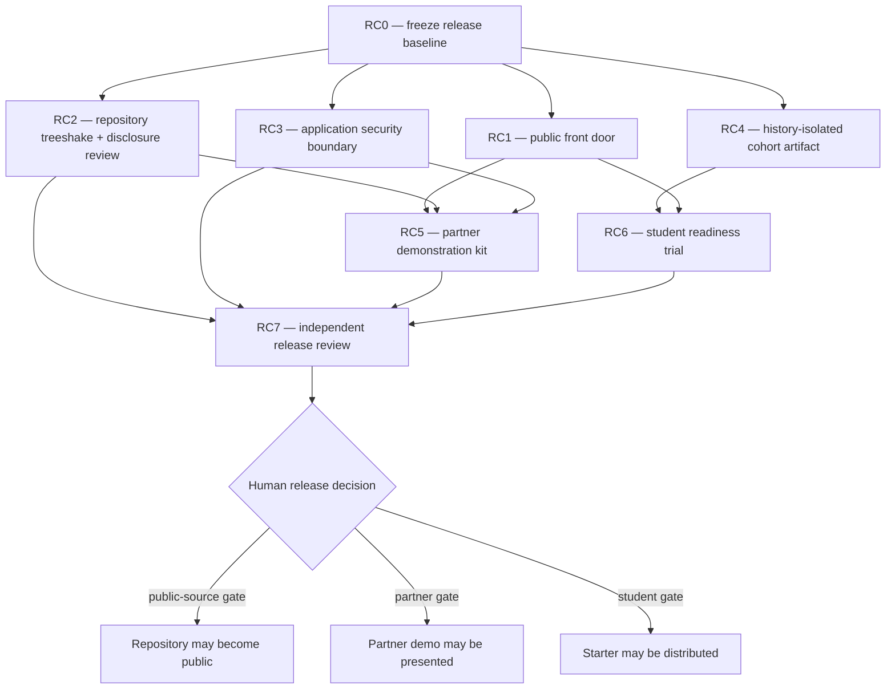

# Phase T — Public Release, Partnership, and Teaching Excellence

**Status:** PROPOSED — planning increment created from the 2026-09-07 cold audit; no phase is
authorized or DONE merely because this cascade exists.  
**Owner:** TTOD product owner (Rubén Vega Balbás PhD)  
**Orchestration:** one bounded phase per agent session; independent verification before promotion  
**Depends on:** Phase Q complete, Phase S through S4 complete, Phase R reference build through R5,
R7 partial  
**Does not authorize:** canonical quote mutation, proposal acceptance, public cloud deployment,
student-owned R6 implementation, or publication of the GitHub repository
**Step labels:** `RC0`–`RC7` ("Release Cascade"), not `T0`–`T7` — cold-audited 2026-09-07 and
renamed from an initial `T0`–`T7` draft, which collided with `docs/research/GUIDE-FORGE-PLAN.md`'s
own unrelated `T0`–`T7` task labels. "Phase T" is this document's own name and is unaffected;
only its eight internal steps were renamed, mechanically, with no change to scope, order, or
dependencies.

## 0. Mission

Raise TTOD from a technically credible private reference build to three deliberately different,
evidence-backed deliverables:

1. a **public-source repository** that is understandable, safe to inspect, correctly licensed,
and free of accidental private-operational disclosure;
2. a **partner demonstration** that can be rehearsed and presented without overstating maturity;
3. a **student starter** whose content and Git history expose only the instructor-built walking
skeleton, never the reference answers students are expected to produce.

Phase T is a release-governance cascade, not a feature sprint. It makes readiness falsifiable.
“The tests pass,” “the repository is public,” and “students can receive it” are three separate
claims with three separate gates.

## 1. Why this phase exists

The 2026-09-07 cold audit found a strong implementation baseline:

- strict corpus validation completed with zero errors and warnings;
- stored metadata matched the recomputed snapshot;
- the core, backend, MCP, and frontend test surfaces were green;
- Astro check returned zero diagnostics and the production frontend built successfully;
- Compose configuration was valid; and
- a targeted tracked-file scan found no obvious credentials or private keys.

It also found release debt that those engineering checks cannot resolve:

- the GitHub entry point is `INDEX.md`, not a conventional `README.md`, and its status, schema,
  and test-count claims are stale;
- accepted proposal records and historical reports dominate repository navigation;
- `private/ttod.yml.pre-q6-backup` is tracked despite its private/archive semantics;
- public documents expose personal filesystem paths and named internal infrastructure;
- the public Caddy surface includes an unauthenticated proposal-writing endpoint;
- public-repository community, security, release, and contribution metadata are absent;
- R7 still names interaction-level and CI evidence gaps; and
- the current `cohort-starter` generator removes reference files in a descendant branch but does
  not, by itself, prove that reference implementations are unrecoverable from Git history.

The audit was read-only. Its observed green counts are evidence captured on that date, not values
to copy into evergreen prose. Phase T must report current counts dynamically from command output.

## 2. Constitutional boundaries

1. **Phase Q governance remains absolute.** Never hand-edit `ttod.yml`; never delete a quote;
   never allocate IDs outside the repository transaction; never promote model output without
   identified human review.
2. **R6 remains student-owned.** Phase T must not add PWA behavior, GitHub Actions CI/CD,
   Lighthouse budgets, Scaleway deployment, or any other deliverable frozen by
   [`DECISIONS/R6-DEFERRED-STUDENT-OWNED.md`](DECISIONS/R6-DEFERRED-STUDENT-OWNED.md).
3. **Public-source work is not public deployment.** Hardening an HTTP boundary and documenting a
   deployment gate does not authorize provisioning or publishing a live service.
4. **Public cleanup preserves evidence.** Historical reports or proposals may be moved to a
   documented archive or release artifact only after retention, provenance, and link impacts are
   measured. “Treeshake” never means silent deletion.
5. **Student distribution requires history isolation.** A branch, sparse checkout, or deletion
   commit is insufficient if a student can recover reference code through reachable objects,
   other refs, tags, remote branches, or ordinary Git commands.
6. **Security claims require negative tests.** A happy-path local demo is not evidence that an
   Internet-facing write endpoint is safe.
7. **Rights remain split.** Code is MIT; governed content and documentation default to
   CC BY-NC-SA 4.0, with item-level rights taking precedence. Phase T does not relicense either.
8. **No hardcoded corpus or test totals in evergreen prose.** Commands generate them at the time
   of verification.

## 3. Release state machine

Each phase moves through:

`BLOCKED → READY → IN_PROGRESS → VERIFYING → DONE`

Only the product owner promotes a phase to `DONE`. The implementing session cannot be its sole
verifier. Every phase report must record:

- commit and clean/dirty worktree state;
- scope and explicit non-scope;
- files changed, moved, archived, or deliberately retained;
- commands, exit codes, and relevant measurements;
- failed attempts and unresolved risks;
- independent verifier identity;
- rollback or safe-resume point; and
- whether `ttod.yml` changed (normally it must not; record before/after SHA-256).

## 4. Orchestration graph



RC1–RC4 may run in parallel after RC0 only when they use separate worktrees and do not overlap
owned files. RC5 and RC6 are integration trials. RC7 is a cold review, not a cleanup session.

## 5. Phase table

| Phase | Purpose | Owner profile | Depends on | Exit result |
| --- | --- | --- | --- | --- |
| RC0 | Freeze facts, audiences, scope, hashes, and risks | release steward | current `main` | signed baseline and decision log |
| RC1 | Build an accurate public front door and community contract | documentation/release | RC0 | newcomer can understand, install, verify, and license the project |
| RC2 | Treeshake navigation and review history/disclosure without losing provenance | repository curator + security reviewer | RC0 | measured public tree and explicit archive/retention decisions |
| RC3 | Define and enforce the local/public HTTP trust boundary | application security | RC0 | unsafe mutation is unavailable or protected outside local development |
| RC4 | Produce a genuinely history-isolated student starter | instructor release engineer | RC0 | reference answers are unreachable from the delivered Git object graph |
| RC5 | Create and rehearse the partner demonstration | product/technical communication | RC1–RC3 | repeatable demo with truthful maturity and fallback paths |
| RC6 | Trial student onboarding on clean machines | instructor + independent novice testers | RC1, RC4 | students reach hello world/live quote without private infrastructure |
| RC7 | Re-run the cold audit and issue three independent verdicts | independent verifier | RC2, RC3, RC5, RC6 | evidence-backed GO/NO-GO per audience |

## 6. Executable phase packages

### RC0 — Release baseline and decision freeze

**Objective:** turn the cold audit into a reproducible baseline without changing product code or
canonical content.

**Required work**

- Record current commit, remote visibility, tracked-file inventory, repository history size,
  largest blobs, ignored local state, and `ttod.yml` digest.
- Record explicitly, not just generically as "remote visibility": whether the R3b/R4/R5/R7
  reference-build commit is reachable from `origin/main` right now (`git merge-base
  --is-ancestor <ref> origin/main`). Verified 2026-09-07: it is — `origin/main` already contains
  the full reference build, in this private repository. This is the exact fact RC4/RC7 must treat
  as unresolved until a genuinely isolated artifact passes the probe suite; RC0 must not let it
  go unstated as "private, so presumably fine."
- Run the full verification matrix in §8 and capture output without hardcoding totals into the
  public README.
- Classify every audit item as blocker, accepted risk, later work, or false positive.
- Freeze the three audiences and their distinct gates.
- Resolve, in writing, whether Phase T security hardening may change backend/Caddy code while R6
  remains student-owned. If not resolved, RC3 stays BLOCKED.
- Resolve the intended public treatment of `proposals/`, detailed phase reports, `sources/`, and
  `private/ttod.yml.pre-q6-backup`; planning alone does not remove them.

**Exit gate:** `PHASE-RC0-REPORT.md` exists, contains a safe resume point, and every RC1–RC4 lane has
a named owner and non-overlapping file set.

### RC1 — Public front door and contribution contract

**Objective:** make the repository legible in five minutes and reproducible in thirty.

**2026-09-07 candidate work:** a documentation-only Jekyll surface and workflow have been built
ahead of RC1 promotion under the separately authorized U1 boundary. Evidence is filed in
[`PHASE-PUBLIC-DOCS-SITE-REPORT.md`](PHASE-PUBLIC-DOCS-SITE-REPORT.md). RC1 is not `DONE`: the
conventional root README, contribution/security contract, clean-copy trial, and independent review
below remain required, and RC0 itself remains `VERIFYING`.

**Required work**

- Add a conventional root `README.md`. Either retire `INDEX.md` through a link-preserving move or
  make one file a short pointer; do not maintain two competing status narratives.
- Lead with purpose, audiences, current maturity, screenshots or architecture only when verified,
  a minimal container quick start, a lightweight CLI quick start, and links to deeper guides.
- Explain the split MIT/CC BY-NC-SA licensing model and why GitHub may display “Other.”
- Add `CONTRIBUTING.md`, `SECURITY.md`, and a concise support/issue policy. Add a code of conduct
  only if the owner intends to accept a public community.
- Replace machine-specific paths in active onboarding with repository-relative commands.
- Generate counts in scripts or verification output; do not embed a mutable total in prose.
- Clearly label reference implementation, student starter, parked sources, and experimental
  material.
- Reconcile `pyproject.toml` project metadata with the split-license explanation without claiming
  the content is MIT.

**Verification:** follow every README command from a clean clone or disposable export; run a link
checker; have a reviewer unfamiliar with TTOD state its purpose, license, and safest first command.

### RC2 — Repository treeshake, retention, and disclosure review

**Objective:** reduce cognitive and disclosure surface while preserving scholarly and governance
value.

**Required work**

- Produce a measured inventory by top-level directory: tracked files, bytes, purpose, audience,
  retention basis, and public/private decision.
- Review both the current tree and reachable Git history for credentials, tokens, private keys,
  personal data, internal IPs/hostnames, absolute local paths, backup files, and generated assets.
- Treat a pattern scan as triage, not proof; manually review every match classified sensitive.
- Decide whether accepted proposal records remain source-controlled audit evidence, become a
  compressed release artifact, or move to a governed archive. Preserve proposal IDs and digests.
- Decide whether detailed execution reports stay public. Prefer a short public roadmap and an
  indexed archive over dozens of equally prominent status files.
- Remove or reclassify the `private/` backup only after confirming it is not required for a
  migration test or legal/provenance record.
- Check all links after moves. Never rewrite Git history merely to make it smaller. Rewrite only
  for confirmed confidential material, with owner approval, remote coordination, and a recovery
  bundle.
- Produce an information architecture: “start here,” “operate,” “learn,” “govern,” and “archive.”

**Exit gate:** no unresolved high-severity disclosure finding; every retained unusual artifact has
a documented reason; the public navigation surface is materially smaller and link-valid.

### RC3 — Application security and exposure boundary

**Objective:** ensure local convenience cannot silently become an unsafe public service.

**Threats in scope**

- unauthenticated proposal creation and disk exhaustion;
- oversized query/history bodies, request floods, slow or abandoned streams;
- prompt/content injection crossing the pedagogical-context boundary;
- path disclosure in API responses (`stored_at` must not reveal server paths publicly);
- unbounded Ollama and embedding work;
- overly broad reverse-proxy exposure, missing security headers, and ambiguous local/public modes;
- proposal-store concurrency and error leakage.

**Required work**

- Define `local`, `demo`, and future `public` exposure profiles. Default must remain safe.
- For any non-local profile, disable `/api/v1/oracle/propose` or protect it with explicit
  authentication/authorization. Never invent production credentials in the repository.
- Add request/body/history limits, timeouts, bounded concurrency/rate policy, sanitized errors,
  and storage quotas appropriate to the selected profile.
- Return proposal identifiers and state, not filesystem locations, across public HTTP boundaries.
- Apply appropriate browser/security headers at Caddy or application level and test them.
- Add negative tests proving unauthenticated mutation, oversized payloads, and exhausted limits
  fail predictably without changing canonical data.
- Document that completing RC3 still does not authorize Scaleway or any public deployment.

**Exit gate:** a security reviewer accepts a small threat model; negative tests pass; canonical
`ttod.yml` digest is unchanged; no public-mode write endpoint is anonymously usable.

### RC4 — History-isolated cohort starter

**Objective:** deliver R1/R2/R3a and the authorized runbooks without recoverable R3b/R4/R5/R7
reference answers.

**Required work**

- Replace “student branch” as the distribution boundary with a fresh repository or orphaned,
  filtered export containing only the intended starter snapshot and a minimal new history.
- Generate a machine-readable allowlist and denylist. Fail closed if a new reference path is not
  classified.
- Ensure no remote, tag, alternate ref, reflog, bundle, submodule, object, commit message, report,
  source map, lockfile artifact, or package cache leaks the reference implementation.
- Clone the exact deliverable into a clean temporary directory and test ordinary recovery probes:
  `git log --all`, `git branch -a`, `git tag`, `git fsck --no-reflogs --unreachable`, object-name
  searches, forbidden-string searches, build output, and archive contents.
- Preserve authorship, license, and the minimum pedagogical decision context.
- Publish a signed checksum for the instructor-approved starter artifact. Distribution itself
  still requires the human student gate.

**Exit gate:** two independent reviewers cannot recover forbidden reference material using the
documented probe suite; the starter builds and runs; its origin and license remain clear.

### RC5 — Partner demonstration kit

**Objective:** make the project easy to understand and hard to overclaim.

**Required work**

- Create a 10–15 minute narrative: problem, governance model, walking skeleton, bilingual corpus,
  graph, grounded/creative Oracle distinction, human proposal review, and roadmap.
- Provide a one-page architecture and trust-boundary diagram derived from the live system.
- Add a preflight command/checklist, seeded demo prompts, expected outcomes, offline screenshots or
  recordings, and a fallback path if Ollama is cold or unavailable.
- State what is production-ready, reference-only, partial, student-owned, and explicitly absent.
- Explain non-commercial content terms before a partner assumes unrestricted commercial reuse.
- Rehearse from a clean environment and record cold-start/model-pull costs separately from warm
  demonstration time.

**Exit gate:** a reviewer can run the demo from the kit alone; every claim maps to evidence; demo
failure does not require exposing private infrastructure.

### RC6 — Student readiness trial

**Objective:** verify pedagogy and onboarding with real novice behavior, not maintainer memory.

**Required work**

- Trial the exact RC4 artifact with at least two clean environments representative of the cohort;
  include Windows/WSL2 or Linux evidence before claiming that platform is supported.
- Time clone-to-hello-world and clone-to-live-quote separately. Record downloads and hardware.
- Test both host Ollama and container Ollama paths when both are advertised.
- Confirm students need no studio host, cloud account, secret, proposal-acceptance authority, or
  access to `main`.
- Add troubleshooting for ports, model availability, memory/disk pressure, container networking,
  build-time `BACKEND_URL`, and teardown.
- Run a comprehension check: students trace browser → Caddy → Astro → backend → `ttod_core` →
  canonical YAML and distinguish canonical data from a proposal.
- Protect voluntary research participation and assessment boundaries already documented in the
  student guide.

**Exit gate:** representative novices reach the declared outcomes without instructor repair; all
found friction becomes a documented fix or accepted limitation.

### RC7 — Independent release review and human decision

**Objective:** issue three narrow verdicts, never one blended “ready” label.

**Required work**

- Re-run §8 from a clean clone at the candidate commit.
- Compare the result to RC0 and explain every material delta.
- Verify RC1 links/onboarding, RC2 disclosure disposition, RC3 negative tests, RC4 isolation evidence,
  RC5 demo rehearsal, and RC6 novice trials.
- Record residual risks by severity, owner, due condition, and audience affected.
- Produce `PHASE-RC7-RELEASE-DECISION.md` with independent results:
  `PUBLIC_SOURCE = GO|NO-GO`, `PARTNER_DEMO = GO|NO-GO`, and
  `STUDENT_DISTRIBUTION = GO|NO-GO`.
- The product owner signs or rejects each verdict separately. Only after that decision may GitHub
  visibility or artifact distribution change.

**No self-healing rule:** RC7 may correct its report, not implementation. A defect sends the
relevant phase back to `IN_PROGRESS`, followed by fresh verification.

## 7. Definition of excellence

Phase T succeeds when:

- a stranger understands TTOD without reading the development-plan archive;
- a maintainer can reproduce all green claims from documented commands;
- the public source tree contains no accidental secrets or unnecessary private-topology detail;
- anonymous Internet users cannot write proposals or exhaust local-model resources;
- a partner sees a truthful, resilient demonstration rather than a fragile live improvisation;
- a student receives a genuine starting point, not answers hidden one Git command away;
- governance, rights, attribution, and provenance remain intact after cleanup; and
- release evidence describes limitations with the same precision as achievements.

## 8. Verification matrix

Run from a clean candidate checkout. Exact test counts belong in phase reports, not this evergreen
contract.

```bash
. .venv/bin/activate
python cli.py validate --strict --json
python cli.py stats --check
python -m unittest discover -s tests -p 'test_*.py'
python -m unittest discover -s services/backend/tests -p 'test_*.py'
python -m unittest discover -s services/mcp/tests -p 'test_*.py'

cd services/frontend
npm ci
npm run check
npx vitest run
npm run build
cd ../..

docker compose config --quiet
git status --short
```

When the relevant environment is available, also run the live stack, Chromium/axe suite, security
negative tests, link checker, history-isolation probe, and documented demo preflight. Missing
environmental evidence must be reported as missing; an older report is not a substitute.

## 9. Orchestrator prompt

Use the following prompt for Phase T execution:

> Act as the TTOD Phase T release orchestrator. Work only inside the authorized TTOD worktree.
> Read `AGENTS.md`, this cascade, `docs/DEV_PLAN/INDEX.md`, the Phase R closure report, the R6
> deferral decision, and the latest completed Phase T reports. Start by identifying the next phase
> whose dependencies are green. Do not execute multiple phase packages in one session. Do not
> mutate `ttod.yml`, accept proposals, change GitHub visibility, push, provision infrastructure,
> deploy publicly, or implement R6. Before editing, record the canonical YAML digest and worktree
> state. Execute only the chosen phase package, run its full exit gate, file a report with commands
> and failures, and stop in `VERIFYING`. A separate verifier must review it before the product
> owner may mark it `DONE`. If an action needs a product decision, credentials, destructive
> history rewriting, or expanded authority, mark the phase BLOCKED and request that decision;
> never infer it from cascade momentum.

## 10. Initial state

| Phase | State at creation | Reason |
| --- | --- | --- |
| RC0 | **BLOCKED — cold review found the baseline stale** | [`PHASE-RC0-COLD-REVIEW.md`](PHASE-RC0-COLD-REVIEW.md), F0 (2026-09-11): `ttod.yml`'s digest and `HEAD` have both moved (22 commits, real canonical-data mutation) since `PHASE-RC0-REPORT.md` froze its baseline. Not promotable as-written; needs a fresh RC0 pass against current `HEAD`, folding in the review's F1–F5 clarity fixes while re-freezing. Originally: VERIFYING, awaiting independent verification. |
| RC1 | BLOCKED | waits on RC0 audience/scope decisions |
| RC2 | BLOCKED | waits on RC0 retention and disclosure decisions |
| RC3 | BLOCKED | waits on RC0 boundary decision and confirmation of non-overlap with R6 |
| RC4 | BLOCKED | waits on RC0 starter contents and delivery-boundary decision |
| RC5 | BLOCKED | waits on RC1–RC3 |
| RC6 | BLOCKED | waits on RC1 and RC4 |
| RC7 | BLOCKED | waits on RC2, RC3, RC5, and RC6 |

The safe next action is **independent verification of RC0 only**. RC1–RC4 remain blocked until the
product owner promotes RC0 to `DONE`.
