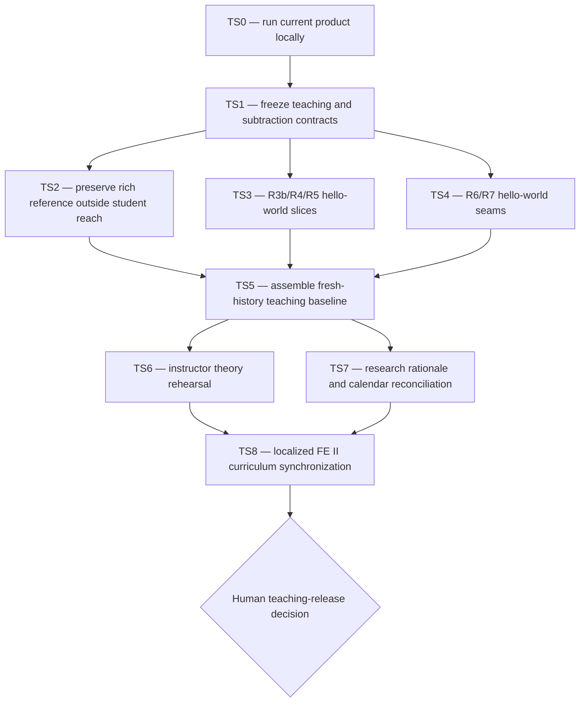

# Phase U — FE II End-to-End Teaching Skeleton

**Status:** PROPOSED — TS0 VERIFYING; the current reference implementation remains unchanged

**Owner:** `@crea-comm.net` teaching studio

**Internal step labels:** `TS0`–`TS8` (“Teaching Skeleton”)

**Depends on:** governed TTOD core, the working Phase R vertical slice, RC0 evidence discipline

**Does not authorize:** canonical quote mutation, public deployment, collection of student research
data, or synchronization into the course repository before the named gate

**Boundary decision:**
[`U0-2026-09-07-TEACHING-SKELETON-BOUNDARY.md`](DECISIONS/U0-2026-09-07-TEACHING-SKELETON-BOUNDARY.md)

**Public documentation decision:**
[`U1-2026-09-07-PUBLIC-DOCS-PAGES-BOUNDARY.md`](DECISIONS/U1-2026-09-07-PUBLIC-DOCS-PAGES-BOUNDARY.md)

## 0. Decision being planned

Replace the student handoff model “R1/R2/R3a only; students invent every later route” with a more
teachable baseline:

- R1–R7 are present as one runnable end-to-end product;
- R3b, R4, R5, R6, and R7 exist only at **hello-world depth**;
- each hello-world slice demonstrates its architectural contract and one real data journey;
- every slice is complete enough to explain and test, but deliberately too small to satisfy the
  assessed assignment;
- students grow the same five seams through localized, phase-owned assignment briefs; and
- the richer instructor reference is retained outside the student-reachable Git object graph.

This is not “give students broken code.” It is **worked-example fading at system scale**: provide a
minimal complete example, teach how the parts connect, then transfer design and implementation
responsibility through increasingly open tasks.

## 1. Pedagogical invariants

1. **Explain before collaborate.** The instructor first runs and teaches the whole request path.
2. **Complete spine, shallow organs.** Every subsystem is real and connected; none contains the
   assignment's full feature depth.
3. **One concept per slice.** Each shell exposes the smallest behavior that makes its FE concept
   observable.
4. **No answer leakage.** The richer reference and its history are absent from the distributed
   artifact.
5. **No artificial failure.** Starter tests pass; routes render; empty states and limitations are
   intentional and documented.
6. **Expansion seams are contracts.** Students extend typed interfaces and acceptance criteria,
   not hidden instructor conventions.
7. **Front-end theory owns the explanation.** Container commands are operational prerequisites,
   not a DevOps theory unit or an assessed infrastructure design exercise.
8. **Local first.** Students run the product locally; no private infrastructure or cloud account is
   part of the teaching path.
9. **Localized parity.** English and Spanish teaching claims have the same scope, calendar, and
   assessment meaning even where route files differ structurally.
10. **Evidence precedes status.** Every TS phase uses the evidence-state report contract.

## 2. Hello-world depth contract

| Lane | Instructor-provided end-to-end proof | Deliberately absent; student assignment depth |
| --- | --- | --- |
| R3b — Astro content | one localized content entry, one collection/schema, one index/detail journey, explicit fallback | taxonomy browsing, full bilingual editorial set, richer content navigation, production information architecture |
| R4 — Svelte graph | one hydrated island, a tiny real node/edge neighborhood, one selection reflected in accessible text | full graph exploration, filtering, layout controls, animation, URL-state design, large-corpus performance |
| R5 — React Oracle | one prompt, one streamed response, visible grounded/creative mode, one cited quote path | session UX, robust state machine, offline proposal flow, motion system, shortcuts, recovery and advanced disclosure |
| R6 — front-end operations/PWA seam | local Compose command, minimal manifest/service-worker registration or explicit stub contract, one observable local/offline boundary | caching strategy, installability quality, offline queue policy, performance budgets, CI/CD design and evidence |
| R7 — testing seam | one unit test, one component test, one live route/contract smoke test, one accessibility assertion | risk-based testing strategy, interaction E2E, contract breadth, flake control, performance/accessibility gates, review evidence |

The TS1 design review must make each “deliberately absent” row measurable. A starter is too rich if
it satisfies the corresponding assessed acceptance criteria without meaningful student design.

## 3. Teaching journey

The theoretical explanation follows one visible system journey:

```text
localized route
  → Astro page/content contract
  → Svelte or React island boundary
  → HTTP/SSE request
  → backend contract
  → retrieval service
  → governed quote snapshot
  → accessible browser state
  → test at the cheapest useful layer
  → local/offline operational boundary
```

Students should be able to point to where rendering occurs, where state lives, where trust changes,
where data becomes governed content, and which test owns each risk. Backend and container internals
are named only to orient the request path; theoretical elaboration remains on front-end architecture,
islands, state, streaming UI, PWA behavior, testing, accessibility, and performance.

## 4. Orchestration graph



TS3 and TS4 may run in parallel only after TS1 freezes shared contracts and assigns non-overlapping
files. TS8 edits a separate course repository and requires fresh authorization at execution time.

The public Jekyll documentation lane is independent of this application cascade. It may explain the
project and research while the application remains local, but it neither satisfies nor changes any
TS or R6 implementation gate.

## 5. Phase packages

### TS0 — Deploy and characterize the current product

Run the documented local container path in an isolated project. Record build time, model download,
port conflicts, service health, localized home pages, live quote, docs, graph, Oracle, teardown, and
canonical digest. Do not refactor during this phase. File `PHASE-TS0-REPORT.md` and stop at
`VERIFYING`.

Gate: the current product is demonstrably end to end, or its exact blocker becomes TS1 input.

### TS1 — Freeze teaching and subtraction contracts

Create a route/feature/test inventory of the rich reference. For every R3b–R7 behavior classify:

- keep as hello-world proof;
- replace with a smaller complete example;
- remove from the student artifact but retain in the rich reference;
- convert into an assignment acceptance criterion; or
- exclude from FE II scope.

Map each retained proof and each assignment seam to FE II Units 2–7. Define shared domain types,
route names, accessibility baseline, localization behavior, and API contracts before code removal.
Freeze a maximum complexity budget per shell using behaviors and concepts, not arbitrary line counts.

Gate: an independent teaching reviewer can explain why each retained line belongs before students
write code and why each removed capability remains assessable.

### TS2 — Preserve the rich reference

Tag and checksum the instructor reference in controlled storage, create a short capability manifest,
and verify recovery. It must not share reachable Git objects, remotes, bundles, tags, or documentation
with the distributed teaching baseline. Never rely on deletion commits for isolation.

Gate: the reference is recoverable by the instructor and unrecoverable from the candidate student
artifact using the RC4 probe family.

### TS3 — Reduce R3b, R4, and R5 to vertical hello worlds

Refactor in dependency-safe order while keeping the full request journey alive:

1. R3b owns localized route/content primitives and one real content example.
2. R4 consumes the frozen graph contract through one small accessible Svelte interaction.
3. R5 consumes the frozen streaming contract through one small accessible React interaction.

Remove ornamental complexity and finished assignment answers. Preserve semantic HTML, language
disclosure, typed boundaries, error/empty states, and one real canonical quote path. Each lane adds
an `ASSIGNMENT.md` that states learning outcomes, constraints, acceptance tests, prohibited
shortcuts, and extension choices without prescribing the implementation.

Gate: the product still runs end to end; each slice demonstrates exactly one teachable framework
boundary; the assignment cannot be passed by relabeling the starter.

### TS4 — Add R6 and R7 hello-world seams

R6 receives the smallest front-end operational seam needed to discuss local execution and offline
architecture. R7 receives the smallest representative test at each teaching layer. Do not build the
full PWA, performance programme, CI/CD solution, or test matrix for students.

The operational guide may say how to install prerequisites, start, inspect, and stop local services.
It must not grow into cloud/server administration theory. All explanatory objectives remain tied to
browser architecture and front-end quality.

Gate: local startup and one offline/testing concept are observable; the assessed R6/R7 design work
remains materially open.

### TS5 — Assemble the fresh-history teaching baseline

Create a new-history artifact containing the governed core, backend walking skeleton, R3a shell,
and TS3/TS4 hello-world slices. Include only the assignment briefs, student guide, licenses, and
public-safe documentation needed for the course. Run privacy, history-isolation, build, test, and
canonical-integrity gates over the exact archive students would receive.

Gate: clean clone to localized hello world and live quote succeeds; rich reference recovery probes
fail; the privacy watcher reports zero findings.

### TS6 — Instructor theory rehearsal

Before collaboration opens, rehearse the localized lesson sequence against the exact TS5 artifact.
For each lane record:

- the concept demonstrated;
- the code boundary shown;
- one live observation;
- one misconception to surface;
- the extension students own; and
- the evidence used to decide it is still barebones.

Run a short comprehension trial: a learner traces the full journey and predicts which component,
island, request, cache, or test changes under a stated scenario.

Gate: the application works as a teaching instrument before it becomes a collaboration substrate.

### TS7 — Research rationale and calendar reconciliation

Update research documents to distinguish four artifacts:

1. rich instructor feasibility reference;
2. instructor teaching baseline with R3b–R7 hello-world slices;
3. student-expanded assessed products; and
4. consented research records, if later authorized.

Ground the rationale for complete-example-first teaching, fading/scaffolding, system tracing,
front-end conceptual transfer, and process evidence through the governed research workflow. Do not
claim learning effects from design intent. Reconcile the calendar in
[`TEACHING-SKELETON-RATIONALE-AND-CALENDAR.md`](../research/TEACHING-SKELETON-RATIONALE-AND-CALENDAR.md)
and all audience guides.

Gate: dates, ownership, assessment, research consent, artifact identity, and evidence strength tell
one story across research documents.

### TS8 — Localized FE II curriculum synchronization

Only after TS5–TS7 are green, update these course-repository targets using repository-relative
identities:

- `web-foundations/docs/tracks/es/feii/index.html`;
- `web-foundations/docs/tracks/en/udit/2627-feii/index.md`; and
- any canonical localized target to which the Spanish compatibility page redirects.

First resolve the information architecture: the named Spanish file is currently a redirect, while
the English file is substantive course content. Do not force textual symmetry between structurally
different files. Synchronize learning outcomes, session timing, deliverable language, local-run
expectations, and the teaching-baseline-to-assignment progression. Preserve each locale's idiom and
link conventions.

Gate: bilingual semantic-parity review, link/build checks in the course repository, and product-owner
approval. This cross-repository phase never runs by cascade momentum.

## 6. Proposed teaching calendar

| Window | Instructor action | Student ownership |
| --- | --- | --- |
| Before Unit 2 | TS0–TS5; verify full local teaching baseline | none; collaboration remains closed |
| Unit 2 | demonstrate Astro shell, rendering modes, and the complete request journey | inspect, trace, and annotate boundaries |
| Unit 3 | demonstrate R3b/R4/R5 island seams and localization | design and expand assigned Astro/Svelte/React lane |
| Unit 4 | demonstrate the minimal R6 offline/local-operation seam | design PWA/offline behavior; local operations only |
| Unit 5 | demonstrate the minimal R7 test pyramid across the same feature | build risk-based unit/component/contract/E2E coverage |
| Unit 6 | apply evidence-state reports and AI-assisted cold review | accept/reject/escalate findings with human rationale |
| Unit 7 | measure before optimizing; relate bundle/runtime cost to user respect | implement and defend a measured performance change |
| Week 7 gate | run integrated local product and oral/diff review | submit expanded work and process evidence |

Calendar dates remain governed by the localized FE II track. TS8 synchronizes wording after the
technical baseline and research rationale are verified; it does not silently change assessment.

## 7. Privacy and identity gate

Every public, partner, student, research-facing, generated, and synchronized artifact must pass the
report-steward privacy watcher. Use repository-relative paths, generic environment roles, and
`@crea-comm.net` for studio identity. Private terms live only in a local untracked denylist supplied
to the watcher. Zero findings are required for the exact distribution artifact.

## 8. Verification matrix

Each implementation phase must run the relevant governed-core tests plus:

- clean Compose build/start/health/teardown;
- both localized home routes and one live quote;
- the R3b content, R4 island, R5 stream, R6 offline/local, and R7 test hello worlds;
- accessibility checks for every teaching route;
- privacy watcher over exact candidate files;
- fresh-history isolation probes;
- protected `ttod.yml` before/after digest; and
- an evidence-state report stopping at `VERIFYING` before independent review.

## 9. Safe next action

Independently verify [`PHASE-TS0-REPORT.md`](PHASE-TS0-REPORT.md) and promote TS0 only if its live
evidence holds. Do not remove rich features or edit the course repository until TS1 freezes the
teaching and subtraction contracts.
