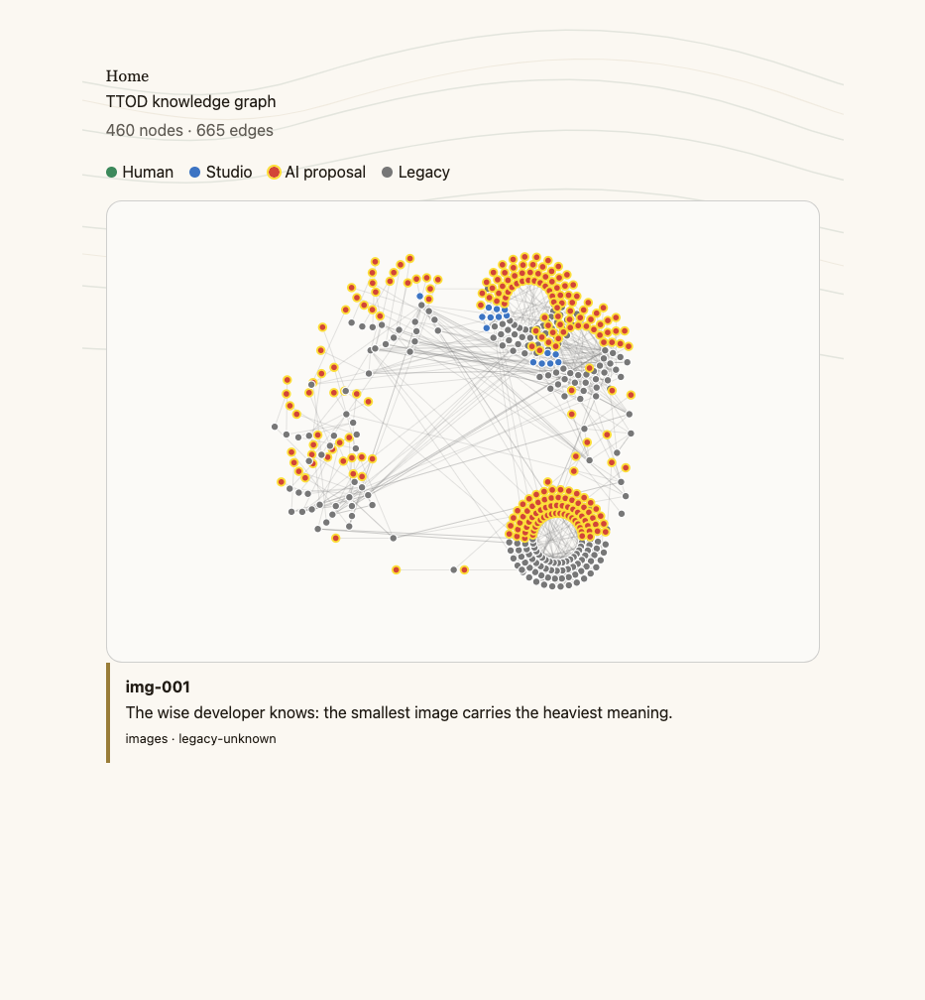

<!--
Phase U TS3b report — R4 Svelte graph hello-world reduction.
Follows cascade-forge evidence-state discipline (status first; claims checked live).
Executed on branch skeleton/ts3b-r4, worktree ../ttod-skeleton-ts3b, forked from
skeleton/ts1-contracts@47f15da9 (never main; did not fork from skeleton/ts3a-r3b).
-->

# Phase U · TS3b Report — R4 graph hello-world

**Status:** DONE

**Scope executed:** the keep/cut in the TS3b runbook
(`docs/DEV_PLAN/PHASES/U-TS3b-r4-graph-hello-world.md` §4 — present on the main checkout, not on
`skeleton/ts1-contracts`) and the TS1 subtraction table R4 row: fetch + `joinTags` +
`radialLayout(allNodes)` + one accessible selection; tag filter, URL state, and GSAP cut;
`ASSIGNMENT.md` filed; `layout.ts` / `layout.test.mjs` byte-identical to `main`.

**Date:** 2026-09-09

**Implementer:** TS3b lane session (worktree only)

**Independent verifier:** pending (runbook §8 — second reader confirms the cut features are
absent from the *rendered* output, not CSS-hidden)

**Owner:** `@crea-comm.net`

**Branch / worktree:** `skeleton/ts3b-r4` at `/Users/ruvebal/src/ttod-skeleton-ts3b`
(forked from `skeleton/ts1-contracts`, not `main`, not `skeleton/ts3a-r3b`)

---

## 1. Pre-flight

- TS1 report status **DONE** — this lane is not BLOCKED.
- TS3a is **DONE** (`skeleton/ts3a-r3b` @ `955198fc`). This lane consumed its frozen
  locale/route contract (`en`/`es` via `[locale]`, 404 otherwise) already present on
  `graph.astro` in the TS1 tree. **No TS3a files were copied or merged.**
- Worktree created as specified:

  ```text
  cd /Users/ruvebal/src/ttod
  git worktree add ../ttod-skeleton-ts3b -b skeleton/ts3b-r4 skeleton/ts1-contracts
  HEAD 47f15da9 TS1: run CI on skeleton/** branches, not only main.
  ```

No edits under `services/backend/`, `services/mcp/`, `ttod_core/`, `ttod.yml`,
`components/oracle/`, `layout.ts`, or `layout.test.mjs`. `graph.astro` was not changed.

```text
$ git diff main -- services/backend/ services/mcp/ ttod.yml \
    services/frontend/src/components/oracle/ \
    services/frontend/src/components/graph/layout.ts \
    services/frontend/src/components/graph/layout.test.mjs
(empty)
```

---

## 2. `layout.ts` / `layout.test.mjs` — byte-identical to `main`

SHA-1 of both files on this branch equals `git show main:…` (cmp silent / identical):

| File | SHA-1 (this branch = `main`) |
| --- | --- |
| `services/frontend/src/components/graph/layout.ts` | `75c7d2960a39478ec72cf491893f7d24127ed0ca` |
| `services/frontend/src/components/graph/layout.test.mjs` | `fface41d31ef5bab682cff71a4f092e626dbfa69` |

`git diff main --` both paths is empty.

`node --test src/components/graph/layout.test.mjs` → **2/2 pass** (untouched). This is the
runner R4's own report documented as authoritative.

`npx vitest run src/components/graph/layout.test.mjs` → exit 1, **No test files found**.
Inherited `vitest.config.ts` (TS1 tree) excludes `src/components/graph/layout.test.mjs`
because it is a `node:test` file (PHASE-R4-REPORT finding 1). That exclusion is not a TS3b
edit and does not mean the tests failed.

---

## 3. What was cut from `GraphIsland.svelte` (104 → 70 lines)

| Block | Hello-world state |
| --- | --- |
| `import { gsap }`, `hover()`, entrance `gsap.fromTo` in `setTag` | removed |
| `activeTag`, `<select>`, `tags` derived, `setTag` | removed |
| `syncFromUrl`, `popstate`, `selectedTag` import | removed |
| `filterGraph` call | removed — layout is `radialLayout(allNodes)` |
| `selected`, `selectNode`, `<aside>`, loading/error | **kept** |
| `role="button"`, `tabindex`, `aria-label`, `onkeydown` (Enter/Space) | **kept** |
| Origin-color `.legend` | **kept** (runbook optional keep) |

Empty-state copy was retargeted from “No nodes carry this tag.” to “No nodes.” because there
is no tag filter. `graphRoot` was dropped with GSAP.

---

## 4. ASSIGNMENT.md

**Path:** `services/frontend/src/components/graph/ASSIGNMENT.md`

Required sections are all present:

| Section | What it names |
| --- | --- |
| Learning outcomes | Svelte 5 runes; island hydration (`client:load` on `[locale]/graph`); SVG accessibility |
| Constraints | must keep using `layout.ts` `radialLayout` / `joinTags`; do not fork layout math; prefer existing `filterGraph` / `selectedTag`; no backend / `ttod.yml` edits |
| Acceptance criteria | tag filter reflected in the URL (`?tag=`); at least one entrance or selection animation; keyboard parity preserved; layout stays shared |
| Prohibited shortcuts | do not remove existing keyboard / `aria-label` handling; do not CSS-hide a leftover `<select>`; do not copy instructor history |

The three removed seams (tag filter, URL state, GSAP) are named in that brief as the assessed
deliverables, not as defects.

---

## 5. Gate evidence (runbook §5)

Compose (`ttod_oracle-*`) was already up from the main checkout: reverse-proxy
`http://localhost:18080`, backend healthy. Live `GET /api/v1/graph` returned **460 nodes /
665 edges**. `GET /api/v1/wisdom/sample` is the same payload TS3a used (460 entries). No
fixtures were invented.

The Docker **frontend** image on `:18080` is still the pre-subtraction build (tag `<select>`
still present). Hello-world was therefore verified from this worktree with:

```text
cd /Users/ruvebal/src/ttod-skeleton-ts3b/services/frontend
BACKEND_URL=http://localhost:18080 npx astro dev --host 127.0.0.1 --port 4322
# throwaway proxy 127.0.0.1:18765 → /api/* to :18080, else to :4322
```

`npm run check` in the worktree frontend: **0 errors, 0 warnings, 0 hints** (30 files).

| Gate | Result |
| --- | --- |
| Island renders real nodes/edges | **PASS** — `/en/graph/` via the proxy showed **460 nodes · 665 edges**; 460 `circle[role=button]` in the DOM; live ids `a11y-001`, `arch-067`, `img-001` |
| One selection works | **PASS** — click on `arch-067` filled the `<aside>`; Enter on focused `img-001` replaced it with that node's text |
| No filter UI | **PASS** — `document.querySelectorAll('select').length === 0`; no `activeTag` / `<select>` in the branch file |
| No animation import | **PASS** — `gsap` is not imported by `GraphIsland.svelte`; no gsap script on the page |
| No URL-param read/write | **PASS** — after click and after keyboard select, `location.search === ""` (`http://127.0.0.1:18765/en/graph/`) |
| `layout.ts` untouched | **PASS** — §2 |
| Keyboard/a11y preserved | **PASS** — each node still has `role="button"`, `tabindex="0"`, `aria-label`, `onkeydown` |
| `ASSIGNMENT.md` present | **PASS** — four required sections |
| Locale contract (consumed, not forked from TS3a) | **PASS** — `/en/graph/` and `/es/graph/` 200; `html lang=es` on the Spanish page |

Live screenshot with one node selected (`img-001` after keyboard Enter):



### Flag to TS1 (not truncated client-side)

Phase U's contract asks for “a tiny real node/edge neighborhood.” The live `/api/v1/graph`
payload is the **full sample (460 / 665)**. Per the runbook, this lane did **not** hide real
data with a client-side cap. If hello-world should be a smaller neighborhood, that is a
backend/sample-size change for TS1's owner — out of this lane's touched-path budget.

---

## 6. Explicit non-claims

This report does **not** claim:

- The Compose frontend container was rebuilt from this branch (it was not; `:18080` still
  serves the rich reference UI with the tag dropdown).
- `npx vitest run src/components/graph/layout.test.mjs` is green — it is excluded by inherited
  Vitest config; `node --test` is the passing runner.
- The 460-node payload is pedagogically “tiny”; that is flagged, not silently truncated.
- TS3c / TS4 lanes have been opened by this session.
- The assignment brief is the implemented filter/animation UI (it is the student seam).
- This branch should be merged to `main`.

---

## 7. Resume rule

| Status | Meaning | Next action |
| --- | --- | --- |
| **DONE (current)** | Reduced island fetches/lays out/selects live data; no filter/URL/GSAP; `ASSIGNMENT.md` filed; `layout.ts` byte-identical to `main` | Independent second reader (§8 of the runbook). TS3c may proceed on its own fork from `skeleton/ts1-contracts`. |
| **PARTIAL** | Named §5 gate unmet | Finish that gate before calling the lane closed |
| **BLOCKED** | TS1 not DONE | Do not open this lane |
