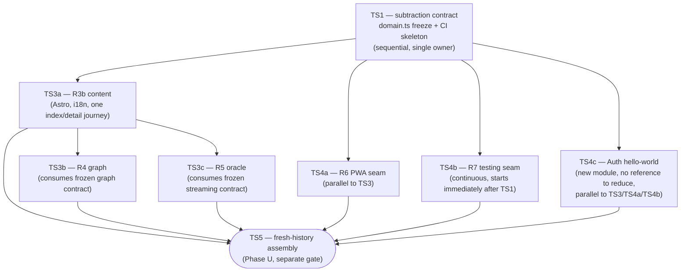

<!--
Self-contained orchestration document for Phase U's TS1/TS3/TS4 — the "Week-0 prerequisite"
named in PHASE-V-FEII-COHORT-COLLABORATION-AND-ASSESSMENT.md §1. Derived from
PHASE-U-FEII-TEACHING-SKELETON-CASCADE.md (normative source; regenerate this if it changes) and
grounded against the live `main` reference build (originally revision `dadacc93`; re-verified this
session against committed `HEAD` `39b62a18` — see PHASE-U-WEEK0-REPORT.md). Produces the six
lane runbooks under PHASES/U-*.md the same way Phase R0 produced PHASES/R*.md.
-->

# Phase U Week-0 — Skeleton Generator: TS1/TS3/TS4 Lane Orchestration

**Status:** GENERATOR DONE (documents only); **TS1–TS4c lane execution DONE** 2026-09-09 — seven isolated `skeleton/*` branches, none merged to `main`. See [`PHASE-U-WEEK0-REPORT.md`](PHASE-U-WEEK0-REPORT.md) closeout table. **TS5 is not opened.**

**Lane tips:** TS1 `47f15da9` · TS3a `955198fc` · TS3b `bfea9da7` · TS3c `5a16a98f` · TS4a `4b2db64e` · TS4b `bcdd5438` · TS4c `445f3257`. CI evidence: draft [PR #1](https://github.com/ruvebal/ttod/pull/1) (do not merge).

**Owner:** `@crea-comm.net` teaching studio

**Produces:** `PHASES/U-TS1-subtraction-and-contracts.md`, `PHASES/U-TS3a-r3b-content-hello-world.md`, `PHASES/U-TS3b-r4-graph-hello-world.md`, `PHASES/U-TS3c-r5-oracle-hello-world.md`, `PHASES/U-TS4a-r6-pwa-hello-world.md`, `PHASES/U-TS4b-r7-testing-hello-world.md`, `PHASES/U-TS4c-auth-hello-world.md`

**Exit:** a fresh, isolated branch (not `main`) containing hello-world-depth R3b/R4/R5/R6/R7,
each with its own `ASSIGNMENT.md`, a frozen `domain.ts`, and a green CI skeleton — the artifact
Phase V's six student modules (`PHASE-V-FEII-COHORT-COLLABORATION-AND-ASSESSMENT.md` §2, revised)
assume exists. **TS4c, added in that same Phase V revision, is the one lane with no existing rich
reference to reduce** — it is a genuinely new hello-world build for the Auth module, grounded in
FE I's own SSR-auth lessons rather than in any code already on `main`. This document's exit is
**not** TS5's fresh-history teaching baseline (a separate, later gate — see §6); it is the working
material TS5 assembles from.

---

## 0. Why this document exists

Phase U names TS1, TS3, and TS4 as narrative phase packages with gates, but never turns them into
the kind of self-contained, paste-into-a-fresh-session runbook that Phase R0 produced for R1–R7.
Phase V then discovered it needed exactly that runbook to exist before Week 1 of student
collaboration could honestly start. This document is that generator pass, run once, now — mirroring
Phase R0's own role ("Stage 1: mold, not forge") for Phase R's seven lanes.

Every fact below was checked against the live `services/frontend/src` tree, not assumed from Phase
U's narrative alone — line counts, exact function names, and exact files to touch are named in each
runbook's §4 so a lane owner is not left guessing what "hello-world depth" means for their specific
file.

---

## 1. What already exists — do not rebuild these

Two things Phase V's §1 gate table listed as prerequisites already exist in the reference build and
only need **freezing**, not creation:

- **`services/frontend/src/types/domain.ts`** (58 lines on committed `main` at `39b62a18`) already
  defines `WisdomEntry`, `GraphNode`, `GraphLink`, `OracleQueryPayload`, `OracleResponseChunk`,
  `OracleProposeRequest`, and `OfflineLogEntry` — exactly the seven shapes R3b/R4/R5/R6 each need.
  TS1's job (§3 below) is to confirm this file is complete and tag it as frozen, not write it from
  scratch. Do not freeze against an uncommitted working tree (a dirty +4-line Oracle locale/themes/
  tags WIP was observed during Week-0 verification — resolve or discard before TS1 freeze).
- **A CI precedent exists** (`.github/workflows/public-docs-pages.yml`) demonstrating this repo's
  Actions conventions (explicit permissions, path-scoped triggers, no inline secrets). TS1's CI
  skeleton (§3) follows this style rather than inventing a new one.

What does **not** yet exist: the hello-world-depth reductions themselves. `GraphIsland.svelte` and
`OracleTerminal.tsx` today contain **both** the hello-world seam and the full assignment-depth
feature set merged into one file (confirmed by direct reading — see each lane's own §4). Reduction
is genuine subtraction with a named target, not a guess.

---

## 2. Lane dependency graph

**Sequential constraint:** TS1 must complete and be confirmed before any other lane opens a
branch — every lane's contract (types, route names, the frozen `domain.ts`) comes from TS1's
output. This matches Phase U §4's own rule ("TS3 and TS4 may run in parallel only after TS1
freezes shared contracts").

**Why TS3a gates TS3b/TS3c specifically (not just TS1):** Phase U §5 TS3 states the dependency
order explicitly — "R3b owns localized route/content primitives... R4 consumes the frozen graph
contract... R5 consumes the frozen streaming contract." R4 and R5 both read wisdom entries R3b's
content layer produces (`GraphIsland.svelte` calls `/api/v1/wisdom/sample` directly today, but the
*route naming and locale contract* R3b freezes is what R4/R5 must not diverge from). TS3b and TS3c
have no dependency on each other and are the clearest parallel-worktree candidates.

**TS4a/TS4b/TS4c run parallel to all of TS3,** gated only on TS1 — R6's hello-world seam ("local
Compose command, minimal manifest/service-worker registration or explicit stub contract") does not
need R4/R5's reduced code to exist first, R7's hello-world seam is explicitly continuous, starting
the moment there is anything to test (R1/R2/R3a already are), and TS4c (Auth) has no dependency on
R3b/R4/R5's content at all — it is new code against `services/backend/**`, the one lane touching
that tree (see `PHASES/U-TS4c-auth-hello-world.md` §0).

**Isolation:** every lane works in its own git worktree/branch off the current `main` tip, never
on `main` directly. `main` stays the untouched rich reference (per `PHASE-R1-R3A-CASCADE-REVIEW.md`'s
own frozen decision) until TS5 explicitly assembles the fresh-history artifact from these lanes'
outputs — TS5 is a later, separate gate this document does not open. Suggested branch names:
`skeleton/ts1-contracts`, `skeleton/ts3a-r3b`, `skeleton/ts3b-r4`, `skeleton/ts3c-r5`,
`skeleton/ts4a-r6`, `skeleton/ts4b-r7`, `skeleton/ts4c-auth`.

---

## 3. TS1 in brief (full runbook: `PHASES/U-TS1-subtraction-and-contracts.md`)

Single orchestrator, sequential, blocks every other lane. Confirms `domain.ts` as frozen (no
edits unless a genuine gap is found — none is expected), publishes a per-lane subtraction/keep
table (the concrete "what stays, what becomes an assignment" decision Phase U's TS1 section asks
for but does not itself enumerate), and stands up the CI skeleton (branch protection + a
lint/typecheck/build workflow, no test content yet — that is TS4b's job) students will PR against.

## 4. TS3/TS4 in brief (full runbooks: `PHASES/U-TS3a…TS4c-*.md`)

Each lane runbook below follows the same template as `PHASES/R6-pwa-cicd-audit.md` and
`R7-testing-strategy.md`: entry/exit gate, required reading, non-negotiable boundaries, exact
domain-contract slice, precise keep/cut scope grounded in the real file, mechanical gates,
touched-path budget, cold-review requirement, phase-report status enum, exact commands, and a
paste-ready agent prompt for a fresh session with no other context.

| Lane | Reduces | From (lines today) | To (hello-world target) | Extracted-as-assignment |
| --- | --- | --- | --- | --- |
| TS3a (R3b) | Wisdom routes + content | `[slug].astro` (19), 3× facet routes (10 each) | index + one detail page, `es`+`en` | section/tag/level browse, richer navigation |
| TS3b (R4) | `GraphIsland.svelte` | 104 lines, full feature set | fetch + radial layout + one click-to-select | tag filter, URL state, GSAP animation, hover |
| TS3c (R5) | `OracleTerminal.tsx` + `sse.ts` | 325 + 63 lines, full feature set | one prompt, one streamed response, one cited quote | offline queue, propose/escalation, exchange history |
| TS4a (R6) | (new) | none exists | manifest stub + SW registration stub, one offline route | Cache-First/Network-First policy, install quality, full CI/CD |
| TS4b (R7) | (new) | none exists | one unit + one component + one route smoke + one a11y test | risk-based strategy, full E2E, flake control |
| TS4c (Auth, new module) | (new) | none exists | login/logout, one server-verified protected route, one bearer-token endpoint | favorites library, propose-while-logged-in, public API docs, bot test app, §2.7's CI proposal pipeline |

---

## 5. Gate before opening any lane

Per this document's own §0 status, **do not start TS1** until the product owner confirms:

1. This orchestration and its six runbooks are approved as written (or with named edits). -> approven
2. A target date for "Week 1 green" — TS1 plus all five TS3/TS4 lanes must land before then. --> Week 1 starts tomorrow Sept 10 2026
3. Who executes which lane — solo, or one lane per available TA/agent session (each runbook's
   §12 agent-prompt is written to be pasted into a fresh session with no other file open, so
   lanes can be delegated independently once TS1 is confirmed).--> Use local ollama qwen3.8:27b as much as posible (delegate workload)

**Note (added when TS4c was introduced, after the above was answered):** item 1's approval was
given against six runbooks; TS4c (Auth, §2/§4 above) is a seventh, added in the same
`PHASE-V-FEII-COHORT-COLLABORATION-AND-ASSESSMENT.md` revision that corrected the cohort to 8
students and added the Auth module. Item 2's date and item 3's delegation instruction (local
Ollama `qwen3.8:27b`) are read as applying to TS4c too, since nothing about them is TS-lane-specific
— but the headcount ("six runbooks," "all five TS3/TS4 lanes") should be read as seven/six
respectively unless told otherwise.

## 6. TS0's findings, read against the confirmed 2026-09-10 start

[`PHASE-TS0-REPORT.md`](PHASE-TS0-REPORT.md) audited a real local Compose deployment (status
VERIFYING) and surfaced four pedagogical findings explicitly flagged there as TS1 input. With Week
1 now dated (§5) and the timeline compressed to five weeks total
(`PHASE-V-FEII-COHORT-COLLABORATION-AND-ASSESSMENT.md` §8.5), none of these are optional polish —
each is now a same-week TS1/TS3/TS4c concern, not a someday-fix:

1. **Port-collision handling.** TS0 ran on alternate ports (`ttod_teaching_audit` project) to avoid
   clobbering another local stack — with 8 students each running their own Compose stack from
   Week 1, this is not a one-off audit workaround, it is every student's first-run experience.
   **Assign to TS1's CI-skeleton/onboarding scope**, or explicitly to TS4a (PWA/local-ops, which
   already owns the Compose surface) as a one-line addition to its hello-world exit criteria: the
   `.env.example`/README must state what to do when a port is taken, not assume a clean machine.
2. **Model-download and cold-start time (~2 min generation, ~30s embedding on first run).** TS0
   found the Oracle can report healthy before its first semantic request is actually warm. This is
   directly relevant to TS4c (Auth) too: a student's first login-gated Oracle/API call after a
   fresh `docker compose up` will look broken if the UI has no "warming up" state.
   **Assign to TS3c (R5 Oracle)'s hello-world scope** — a minimal loading/cold-start indicator
   belongs in the seam itself, not deferred as assignment-depth polish, precisely because it will
   otherwise cost real Week-1/2 debugging time across all 8 students independently rediscovering
   the same non-bug.
3. **Static-route health and streaming retrieval are separate gates.** Relevant to TS4b (R7
   testing seam): a health check that only proves the static route responds gives false confidence.
   **Assign to TS4b's hello-world test scope** — the one smoke test it ships should hit the
   streaming path, not just a static route, or it teaches the wrong lesson about what "healthy"
   means.
4. **"The graph is already far beyond hello-world scale" / "the rich UI still contains too much
   finished assignment depth."** This is TS1's own subtraction-table mandate (§4 item 1 above) —
   TS0 is independent confirmation that the cut needs to be real, not cosmetic, for TS3b (R4) and
   TS3a/TS3c in particular. With five weeks total and Week 1 starting 2026-09-10, an
   under-reduced starting point is the single likeliest way to lose the pacing §8.6 of the Phase V
   revision is designed to protect.

None of this changes TS0's own filed status (VERIFYING, `ttod.yml` unchanged, no canonical
mutation) — it only routes TS0's findings to the specific lanes that must act on them before
2026-09-10.

## 7. What this document does not do

It does not implement TS5 (fresh-history assembly), TS6 (instructor rehearsal), TS7 (research
rationale), or TS8 (course-repository sync) — those remain Phase U's own later gates, unchanged.
It does not touch `main`. It does not authorize deleting the rich reference's code — subtraction
happens on isolated branches; `main` is read from, never written to, by any TS1/TS3/TS4/TS4c lane.
