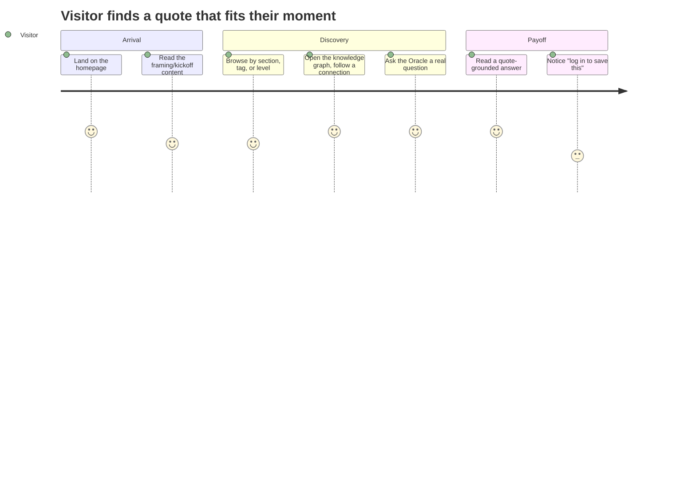
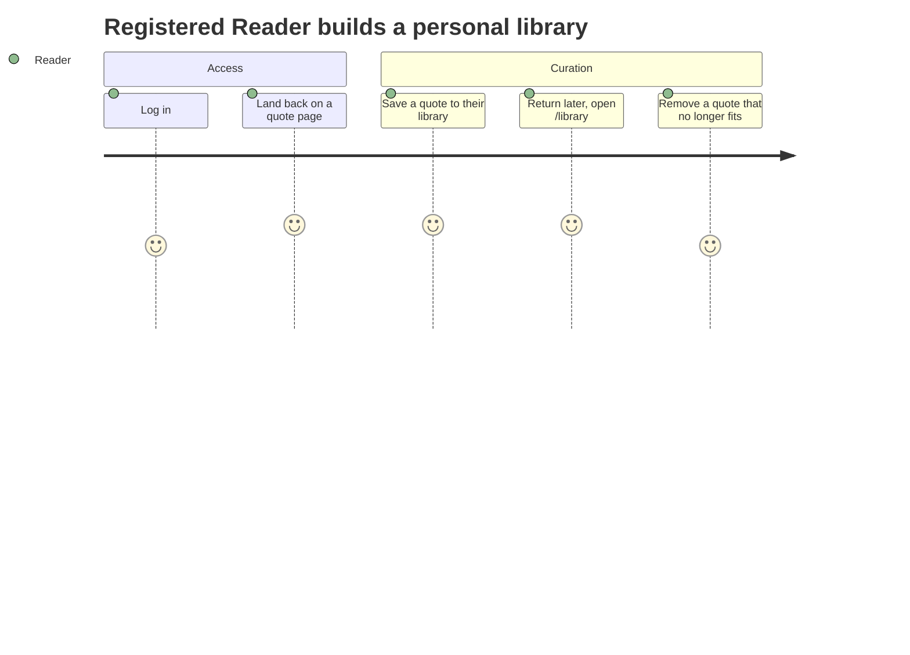
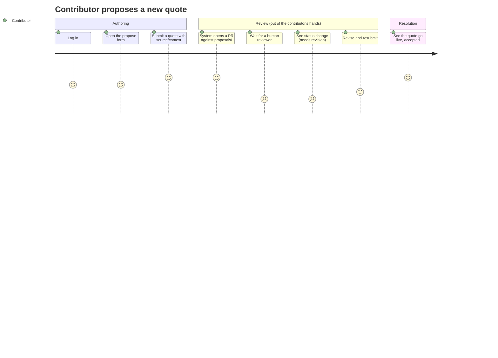
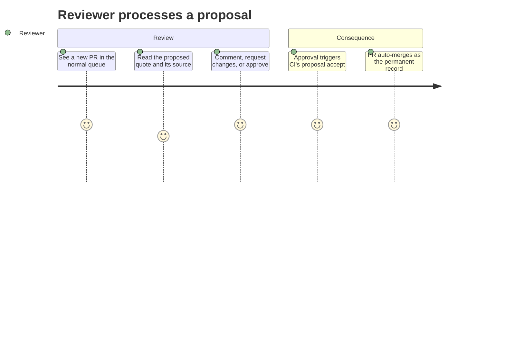
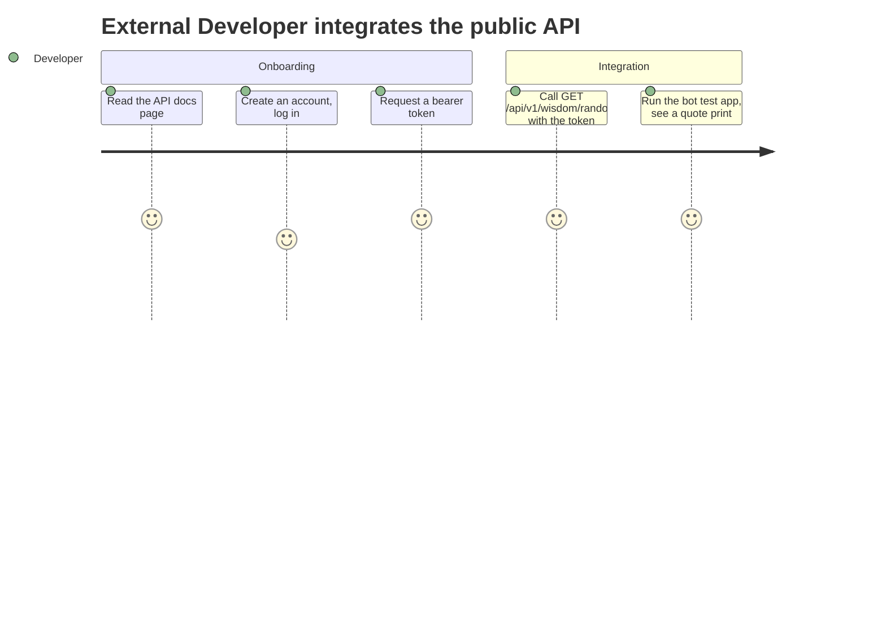

<!--
Companion to PHASE-V-FEII-COHORT-COLLABORATION-AND-ASSESSMENT.md, in the same relationship
PHASE-U-WEEK0-ORCHESTRATION.md has to Phase U: Phase V's module table (§2) tells the cohort HOW
engineering work is organized (six modules, teams, PR guardrails, rubric). This document tells
them WHY and FOR WHOM — the product-owner artifact Phase V assumed but never wrote: a backlog in
user-value terms, the journeys those users actually walk, and an explicit accessibility stance
that today only exists as scattered engineering acceptance criteria (`grep -rn accessib`/`a11y`
across DEV_PLAN turns up axe assertions and ARIA attributes, never a stated *why*).
-->

# TTOD FE II — Product Backlog, User Journeys & Accessibility Philosophy

**Status:** PROPOSED — a product-framing companion to Phase V, not a new engineering phase; it
gates nothing and blocks nothing. Read alongside
[`PHASE-V-FEII-COHORT-COLLABORATION-AND-ASSESSMENT.md`](PHASE-V-FEII-COHORT-COLLABORATION-AND-ASSESSMENT.md)
§2 (the module/team table this backlog's epics map onto) and §8.5 (the session-by-session calendar
this backlog's roadmap is sequenced against — six weekly content sessions plus the defense, per
the confirmed cadence in `PHASE-V-SPRINT-SESSIONS-AND-METHODOLOGY.md` §1.5).

---

## 1. Personas — who this product actually serves

| Persona | Wants | Frequency |
| --- | --- | --- |
| **Visitor** (anonymous reader) | Find a wisdom fragment relevant to a moment, with no friction, no signup | Every session |
| **Registered Reader** | Keep a personal library of quotes worth returning to | Recurring |
| **Contributor** | Add a quote they believe belongs in the corpus | Occasional |
| **Reviewer** | Judge proposals with the same tools they already trust for code review | Recurring, low-volume |
| **Instructor / Product Owner** | The corpus stays governed — nothing lands in `ttod.yml` without a named human's decision | Continuous, background |
| **External Developer** | Build something on top of TTOD's data without scraping HTML | Occasional, self-serve |

One deliberate omission: there is **no separate "accessibility persona."** Treating disabled
users as a distinct persona with distinct, lower-priority stories is exactly the pattern §3 below
argues against — accessibility here is a property of *every* persona's experience, not a feature
request from one of them.

*(A seventh stakeholder, the Student-Developer building this product, is not a persona of the
shipped app — they're the team. Phase V §2's module/team table is their org chart; this document
is what they're building toward.)*

## 2. Vision

TTOD exists to make a single act cheap and reliable: putting a person in front of the fragment of
wisdom that fits their moment, and letting them come back to it, keep it, question it, or add to
it. Every epic below is one of those four verbs — **find, keep, question, contribute** — done for
one persona. Nothing here is a feature for its own sake; if a backlog item doesn't serve one of
those four verbs for a named persona, it doesn't belong in Now/Next/Later (§6).

---

## 3. Accessibility as philosophy, not a checklist

Search the rest of this dev plan for "accessib" or "a11y" and every hit is the same shape: an
`axe` assertion, a `role="button"`, a keyboard handler, one line in a rubric worth 10 points
(Phase V §5). That is real and it should stay — but it is a **floor**, stated nowhere as a
**reason**. This section is that reason, made explicit so it can be cited instead of re-derived
every time a lane owner asks "why does this matter here specifically."

**The argument, stated plainly:** TTOD's content makes a universalist claim about itself — an
aphorism is offered as wisdom that holds regardless of who is reading it, when, or in what
circumstance. A product built on that claim cannot then quietly narrow *who is able to receive
it* based on how they perceive a screen. That would not be a minor UX gap; it would contradict the
content's own premise. Accessibility in TTOD is therefore not compliance bolted onto a finished
feature — it is **continuity of the same principle the corpus already claims for itself.**

**Grounded in the studio's own vocabulary, not invented for this section:** the workspace root's
own epigraph names the operating principle directly — *"Every creation is a recreation of the
original principle (arkhe). Code, like alchemy, transforms."* (`/src/CLAUDE.md`). An athanor is
the alchemical furnace: matter passes through it and changes vessel, changes form, sometimes
changes state entirely — but the operation only counts as *transmutation*, not loss, if the
essential principle survives the change of container. That is exactly the contract a rendering
pipeline owes an aphorism. A quote read on a screen, heard through a screen reader, or felt on a
braille display is the same operation as the athanor's: one arkhe, carried through different
vessels. If the *meaning* survives the passage through only one of those vessels — sight — the
transmutation failed; what came out the other end is a diminished thing wearing the original's
name. The same workspace's closing epigraph makes the demand in a different register — *"Null implies an
answer, not positive nor negative, a zero at least, an answer at last"* (`void != null`, TTT2020,
Vienna, `/src/CLAUDE.md`) — an interface that returns nothing perceptible to some readers is
exactly the null this studio's own working principle was already built to refuse. This is why §3 item 1 (content parity) is not a UX nicety
layered on top of the content's meaning — it is the same operation the content itself claims to
perform, applied one layer down, to the vessel instead of the words.

This resolves into three concrete commitments, not just one:

1. **Content parity.** No meaning may exist in only one channel. A graph selection must be
   readable as text (already the exact language Phase U's own R4 contract uses — "one selection
   reflected in accessible text" — this section is naming the principle that sentence was already
   quietly enforcing). A streaming Oracle answer must be announced to assistive tech as it arrives,
   not just rendered visually. Color may reinforce a distinction but never be the only carrier of
   one.
2. **Process, not gate.** Unit 5's own curriculum content (Phase V §8) already teaches this:
   accessibility assertions run inside the normal PR suite on every change, not as a
   pre-submission audit bolted on at the end. That is a philosophy of *when* you check, not just
   *what* you check — treat it as one, and say so to students explicitly, because the alternative
   (a11y as a last-week scramble) is the more common failure mode this design is meant to prevent.
3. **A whole-product baseline, not one team's line item.** Today accessibility is scoped inside
   R7's rubric line (Phase V §5, 10 points) as if it were one team's deliverable alongside unit
   tests. Phase V §2 already made exactly this move for *testing* generally — folding R7 out of a
   dedicated team into "everyone's continuous responsibility" because "R7's own runbook already
   says testing pairs with each lane owner as their feature lands." **Accessibility should receive
   the identical treatment, named explicitly:** every epic in §5 below inherits the same four-item
   Definition of Done, regardless of which module owns the story.

**Definition of Done — accessibility clause, applies to every story in §5:**
keyboard-operable, one accessible name/label present, no color-only distinction, respects
`prefers-reduced-motion`. This is deliberately small enough to check on every PR — matching R6/R7's
own "PR feedback under 5 minutes" discipline (Phase V §8) — not a separate audit phase.

---

## 4. User journeys

Five journeys, one per primary persona-and-verb pair from §2. Each is a `mermaid journey` diagram
(GitHub renders these natively) scored 1–5 on how the step should feel when the product is working
— a low score names where friction is *expected and acceptable* (e.g., waiting for a review), not
a bug to eliminate.

### 4.1 Visitor — find

### 4.2 Registered Reader — keep

### 4.3 Contributor — contribute

The low scores in the "Review" section are intentional, not a defect to design away — §2.7 of
Phase V is explicit that only a named human's PR approval may ever accept a proposal into
`ttod.yml`. A contributor journey that scored 5 all the way through would mean that gate had been
quietly removed.

### 4.4 Reviewer — govern

### 4.5 External Developer — build on it

---

## 5. Product backlog — epics and stories

Priority uses MoSCoW (**M**ust / **S**hould / **C**ould for this cohort's six-session calendar).
Every story inherits §3's accessibility Definition of Done — it is not repeated per row. "Module"
cross-links to Phase V §2's engineering table for the HOW.

### Epic A — Browse & Discover (find) · Module 01

| # | Story | Priority |
| - | --- | --- |
| A1 | As a Visitor, I want to browse quotes by section/tag/level in my language, so I can find something relevant without knowing what to search for. | Must |
| A2 | As a Visitor, I want every quote page to show its source/context, so I can trust where it came from. | Must |
| A3 | As a Visitor, I want breadcrumbs back to the section/tag I came from, so browsing doesn't strand me. | Should |

### Epic B — Explore Relationships (find) · Module 02

| # | Story | Priority |
| - | --- | --- |
| B1 | As a Visitor, I want to see how quotes relate to each other in a graph, so I can discover connections a list view hides. | Must |
| B2 | As a keyboard or screen-reader user, I want every graph selection reflected in accessible text, so the graph is a real feature for me, not a decorative one. | Must |

### Epic C — Ask the Oracle (find, question) · Module 03

| # | Story | Priority |
| - | --- | --- |
| C1 | As a Visitor, I want to ask a real question and get a quote-grounded answer, so I get guidance, not just a static list. | Must |
| C2 | As a Visitor, I want the answer to stream in, so a multi-second wait doesn't feel dead. | Should |
| C3 | As a screen-reader user, I want the streaming answer announced via a live region as it arrives, so I'm not left in silence while others watch text appear. | Must |
| C4 | As a Visitor on a cold-started deployment, I want to see a "preparing" state instead of a silent hang, so I don't think the app is broken (TS0 finding, §6 of `PHASE-U-WEEK0-ORCHESTRATION.md`). | Must |

### Epic D — Take It Offline (find) · Module 04

| # | Story | Priority |
| - | --- | --- |
| D1 | As a returning Visitor with unreliable connectivity, I want previously seen content to work offline, so a bad connection doesn't block me. | Should |
| D2 | As a Visitor, I want to install TTOD like an app, so it feels first-class on my device. | Could |

### Epic E — Make It Mine (keep) · Module 05

| # | Story | Priority |
| - | --- | --- |
| E1 | As a Visitor, I want to create an account and log in, so I can personalize my experience. | Must |
| E2 | As a Registered Reader, I want to save a quote to a personal library, so I can find it again without re-searching. | Must |
| E3 | As a Registered Reader, I want to remove a quote from my library, so my list stays curated to what still matters to me. | Should |

### Epic F — Contribute Wisdom (contribute) · Module 05

| # | Story | Priority |
| - | --- | --- |
| F1 | As a Registered Reader, I want to propose a new quote, so I can contribute to the corpus, not just consume it. | Must |
| F2 | As a Contributor, I want to see my proposal's status (open / needs revision / accepted / rejected), so I'm not left wondering what happened to it. | Must |
| F3 | As a Reviewer, I want to review proposals with the same PR tools I already use for code, so I don't have to learn a second review system. | Must |
| F4 | As the Instructor/Product Owner, I want only a named human's approval to ever write the canonical corpus, so no automation — AI included — silently changes governed content. | Must |

### Epic G — Build On TTOD (question, externally) · Module 05

| # | Story | Priority |
| - | --- | --- |
| G1 | As an External Developer, I want a documented, token-authenticated API, so I can build on TTOD without scraping HTML. | Must |
| G2 | As an External Developer, I want a minimal working example client, so I have a known-good starting point instead of guessing at the contract. | Must |

### Epic H — Trust the Experience (cross-cutting, every module)

| # | Story | Priority |
| - | --- | --- |
| H1 | As any user regardless of ability, I want every feature keyboard-operable with visible focus and no color-only meaning, so accessibility is the product's baseline, not a feature for one persona (§3). | Must |
| H2 | As any user, I want pages to load fast and stay responsive, so the experience matches the considered, unhurried tone of the content itself. | Should |
| H3 | As a returning user, I want clear feedback when something is still loading or warming up rather than silence, so I trust the system instead of reloading blindly. | Should |

---

## 6. Roadmap — Now / Next / Later, against the confirmed session calendar

Sequenced against Phase V §8.5's recalibrated table (six weekly content sessions plus the
defense). This is intentionally coarse — each module's own runbook and Phase V §2 own the
day-to-day detail, and
[`PHASE-V-SPRINT-SESSIONS-AND-METHODOLOGY.md`](PHASE-V-SPRINT-SESSIONS-AND-METHODOLOGY.md) §3 owns
the session-by-session detail, pulling these exact epic/story IDs into each session's lab-time
list.

| When | Epics in focus | Rationale |
| --- | --- | --- |
| **Now** — Session 1 (2026-09-10) | A, E1 (login only, started) | Nothing else has a UI to browse or a session to attach a library to until content routes and auth exist — the shorter 2h first session means E1 likely finishes in Session 2, not Session 1. |
| **Next** — Sessions 2–3 (week of 09-17, week of 09-24) | B, C, D, E2–E3, F1–F3 | The graph, oracle, offline boundary, and the full save/propose loop — the bulk of what makes TTOD TTOD. |
| **Later** — Sessions 4–6 (week of 10-01 through week of 10-15) | F4 hardening, G, H | CI proposal pipeline hardening, the public API + bot app, and accessibility/performance passes land once the features they cover already exist to be tested and hardened — not because they matter less (§3 argues the opposite for H), but because there is nothing to check against before then. |

## 7. Traceability — this backlog is not a second source of truth

This document decides *why/for whom*. Phase V §2's module table decides *how/who builds it*. If
they ever disagree, Phase V's engineering table wins on scope and sequencing; this document should
be corrected to match, not the reverse — it exists to make the module table legible in product
terms, not to compete with it.

| Epic | Phase V module | Runbook |
| --- | --- | --- |
| A | 01 — Content | `PHASES/U-TS3a-r3b-content-hello-world.md` |
| B | 02 — Graph | `PHASES/U-TS3b-r4-graph-hello-world.md` |
| C | 03 — Oracle | `PHASES/U-TS3c-r5-oracle-hello-world.md` |
| D | 04 — PWA | `PHASES/U-TS4a-r6-pwa-hello-world.md` |
| E, F, G | 05 — Auth/Library/Proposals/API | `PHASES/U-TS4c-auth-hello-world.md` + Phase V §2.5–§2.7 |
| H | cross-cutting | `PHASES/U-TS4b-r7-testing-hello-world.md` + Phase V §3 |

---

## 8. Public-docs publication gate — after phase implementation, not now

This backlog, its journeys, §3's accessibility philosophy, and
`PHASE-V-SPRINT-SESSIONS-AND-METHODOLOGY.md`'s session chart currently live only in `docs/DEV_PLAN`
(internal). They belong on the public site once there is a real, running hello-world skeleton to
describe — publishing *before* Phase U's TS1–TS4c lanes actually land would put a plan on the
public site with nothing built yet to back it, which is exactly the discipline the existing public
pages already hold (`docs/public/teaching/index.md` calls itself "the **proposed** teaching
baseline," present tense only once it is true). **Trigger: after Phase U's TS1–TS4c lanes reach
`DONE`** (i.e., once `PHASE-U-WEEK0-REPORT.md`'s "generator" content is followed by real lane
execution reports) — not before, and not automatically on that date either; someone still writes
and reviews the public-facing pages then.

**Where each artifact lands**, following the existing `docs/public/` structure (bilingual, `en` +
`es/` mirror, per U1's own pattern — see `DECISIONS/U1-2026-09-07-PUBLIC-DOCS-PAGES-BOUNDARY.md`):

| Artifact | Target page | Notes |
| --- | --- | --- |
| Backlog epics (§5) + roadmap (§6) | `docs/public/teaching/index.md`, extending its existing "Units 1–7 on the TTOD spine" table | Student-facing framing already exists there ("your assignment is to make those areas useful..." on `audiences/students.md`) — this adds the concrete epic list that language currently only gestures at |
| User journeys (§4) | `docs/public/audiences/students.md` | The five `mermaid journey` diagrams are exactly the "what you will be able to do" section's missing concrete illustration |
| Accessibility philosophy (§3) | New `docs/public/teaching/accessibility.md` (+ `es/` mirror) | Currently accessibility has **no** page on the public site at all despite Units 5/7 having their own framing there — this is a real gap, not just a missing cross-link |
| Session/sprint chart (`PHASE-V-SPRINT-SESSIONS-AND-METHODOLOGY.md` §3) | `docs/public/teaching/index.md`, as a new "How a session runs" subsection | The theory → team-meeting → lab-time rhythm is exactly the kind of pedagogical-transparency content this page already carries for the ATELIER cycle equivalent on the course-track site |

**What does not get published:** anything from Phase V's own guardrail/rubric internals that
reads as an internal evidence report (per U1's boundary — "internal evidence reports, evaluations,
local topology, and studio machinery are not copied into the publication source"), the exact
CI/CD `--reviewer-id` mechanics of §2.7 beyond a plain-language description, and nothing from
`PHASE-U-WEEK0-REPORT.md` itself (a dated evidence report, not public-facing content by its own
genre). **This section does not authorize a Pages deployment by itself** — same non-authorization
discipline U1 already states for its own boundary; someone still triggers and reviews the actual
publish when the trigger condition above is met.
